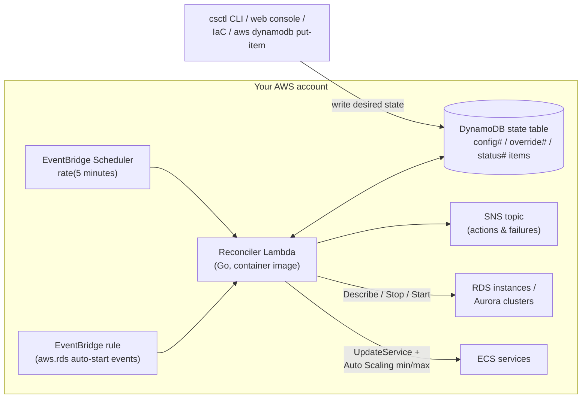

# cheapskate

Keep RDS instances and Aurora clusters **stopped beyond the 7-day auto-start limit**, and schedule start/stop for RDS and **ECS services** (desiredCount 0 / restore) — driven by desired state stored in DynamoDB and a serverless reconcile loop.

- AWS force-starts stopped RDS/Aurora after 7 days. cheapskate catches the auto-start events (`RDS-EVENT-0153` / `RDS-EVENT-0154`) and stops them again.
- Resources whose desired state is `running` are never touched.
- Cron-based schedules (e.g. weekdays 09:00–20:00) use the same reconcile loop, so schedules and keep-stopped pinning can never conflict.
- Cost of the control plane: well under $1/month (one Lambda on a 5-minute loop).

cheapskate is distributed as **source code only** — there is no CloudFormation/Terraform template, module, or public container image to consume. You build the image, push it to your own ECR, and create the (few) AWS resources with your own IaC or by hand; [usage/setup.md](usage/setup.md) specifies everything needed.

## Architecture

Every cycle the Lambda compares desired state (DynamoDB) with actual state (Describe APIs) and converges. Resources in transitional states (`starting`, `stopping`, …) are skipped and picked up on the next cycle. Only the reconciler Lambda calls RDS/ECS APIs; `csctl` and the web console touch nothing but the DynamoDB table.

## Documentation

Usage — hosting cheapskate in your own AWS account:

- [usage/setup.md](usage/setup.md) — everything to build and create, with concrete settings, IAM policies, and example commands
- [usage/operations.md](usage/operations.md) — registering resources, the `csctl` CLI, the web console, monitoring

Development — working on cheapskate itself:

- [development/build.md](development/build.md) — building binaries and the container image
- [development/test.md](development/test.md) — unit/integration tests and lint
- [development/run_local.md](development/run_local.md) — running the reconciler and web console locally

Design notes (Japanese): [DESIGN.md](../../DESIGN.md), [consider.md](../../consider.md).

## License

MIT
