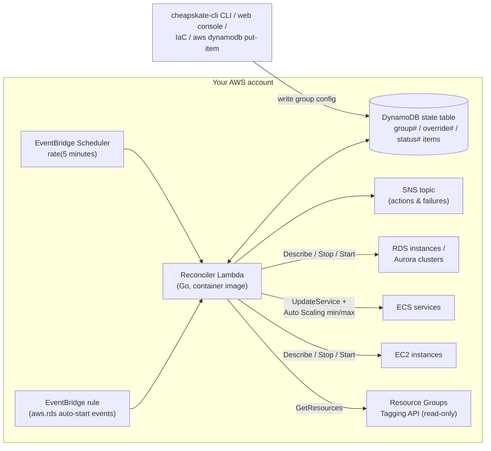

# cheapskate

Keep RDS instances and Aurora clusters **stopped beyond the 7-day auto-start limit**, and schedule start/stop for RDS, **ECS services** (desiredCount 0 / restore), and **EC2 instances** — driven by desired state stored in DynamoDB and a serverless reconcile loop. Resources are never registered individually: a **target group** carries the schedule/pin/override config plus a selector (an AWS tag key/value + resource types), and membership is resolved live via the Resource Groups Tagging API — tag a resource with the selector and it's managed on the next cycle.

- AWS force-starts stopped RDS/Aurora after 7 days. cheapskate catches the start-completed events (`RDS-EVENT-0088` / `RDS-EVENT-0151`) and stops them again.
- Resources whose desired state is `running` are never touched.
- Cron-based schedules (e.g. weekdays 09:00–20:00) use the same reconcile loop, so schedules and keep-stopped pinning can never conflict.
- Cost of the control plane: well under $1/month (one Lambda on a 5-minute loop).

cheapskate is distributed as **source code only** — there is no CloudFormation/Terraform template, module, or public container image to consume. You build the images (one for the reconciler, one for the optional web console), push them to your own ECR, and create the (few) AWS resources with your own IaC or by hand; [usage/setup.md](usage/setup.md) specifies everything needed.

## Architecture

Every cycle the Lambda resolves each group's selector via the Tagging API, then compares desired state (DynamoDB) with actual state (Describe APIs) and converges. Resources in transitional states (`starting`, `stopping`, …) are skipped and picked up on the next cycle. Only the reconciler Lambda calls RDS/ECS/EC2 control APIs; `cheapskate-cli` and the web console touch the DynamoDB table plus the read-only Tagging API (for `show` and the group page).

### Package layers

`internal/` is split by layer, and dependencies only ever point inwards:

| Layer | Packages | May import |
| --- | --- | --- |
| Domain | `core/model`, `core/schedule` | nothing (stdlib only) |
| Persistence | `state` | `core` |
| Application | `app/groups`, `app/reconcile`, `app/doctor`, `app/port` | `core`, `state`, `app/port` |
| AWS adapters | `aws/tagging`, `aws/compute`, `aws/sns`, `aws/cloudwatch` | `core` |
| Frontends | `ui/cli`, `ui/webconsole` | `core`, `state`, `app`, `wire` |
| Composition | `wire` | anything |

`internal/app` never imports `internal/aws`: what the application needs from the outside world is declared as four interfaces in `internal/app/port` (`Discoverer`, `Target`, `Describer`, `Notifier`), the `internal/aws` packages implement them, and `internal/wire` is the only place that knows which AWS client backs which port. The state table is deliberately not a port — it is intrinsic to cheapskate rather than pluggable, so the application layer uses `internal/state` directly and its tests mock the DynamoDB client underneath. Not pluggable is not the same as unrestricted, though: each consumer declares the slice of the store it actually needs (`reconcile.Store`, `groups.Store`, `doctor.Store`), so the reconciler has no method with which to write group config or overrides, and the config frontends have none with which to write a status record. The table's key layout and item shapes stay inside `internal/state`; `core/model` holds domain types only and knows nothing about how they are stored.

The Japanese docs carry the full tree: [../ja/architecture/overview.md](../ja/architecture/overview.md#リポジトリ構成).

## Documentation

Usage — hosting cheapskate in your own AWS account:

- [usage/setup.md](usage/setup.md) — everything to build and create, with concrete settings, IAM policies, and example commands
- [usage/operations.md](usage/operations.md) — target groups, selectors, the `cheapskate-cli` CLI, the web console, monitoring
- [usage/troubleshooting.md](usage/troubleshooting.md) — detecting failures, recovering from half-finished work, and pruning leftovers with `doctor`

Development — working on cheapskate itself:

- [development/build.md](development/build.md) — building binaries and the container images
- [development/test.md](development/test.md) — unit/integration tests and lint
- [development/run_local.md](development/run_local.md) — running the reconciler and web console locally

## License

MIT
