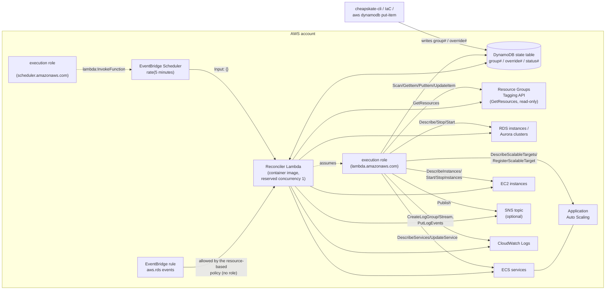
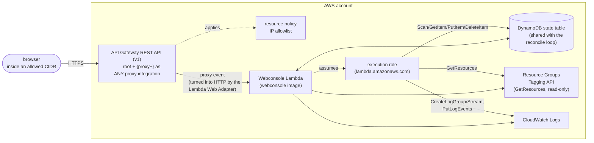

# AWS resource diagrams

The AWS resources to create fall into two groups: the reconcile loop, which runs permanently, and the web console, which is deployed only if wanted. Beyond sharing the DynamoDB state table the two are independent, and the reconcile loop is complete without the web console.

## Resources for the reconcile loop

Drawing the resources that make up the reconcile loop, and the flow of data between them, gives the following diagram.

The role of each resource in the diagram, and whether it is required, is collected below.

| Resource | Role | Required |
|---|---|---|
| DynamoDB state table | The only persistent store, holding the desired state (`group#`/`override#`) and the results the reconciler writes (`status#`) | Required |
| Reconciler Lambda (container image) | The reconcile loop itself. Reserved concurrency of 1 rules out concurrent runs | Required |
| Lambda execution role | DynamoDB reads and writes, `tag:GetResources`, the Describe and control APIs for RDS/ECS/EC2, Application Auto Scaling, `sns:Publish` (when configured), and CloudWatch Logs | Required |
| EventBridge Scheduler (`rate(5 minutes)`) | The trigger for the periodic reconcile. Passes `{}` | Required |
| EventBridge rule (`aws.rds` events) | Triggers an immediate reconcile when an RDS auto-start event arrives. Target invocation is allowed by the Lambda's resource-based policy, so the rule needs no IAM role | Required |
| Resource Groups Tagging API | The only route from a selector to the resources | Required |
| RDS / ECS / EC2 (including Application Auto Scaling) | The resources being started and stopped. Permissions and connections for unmanaged resource types may be omitted | Only for the types in use |
| SNS topic | Where notifications of actions and failures go. With none configured, notification is a no-op | Optional |
| CloudWatch log group | Where the function's logs go. Creating it in advance and setting a retention period is recommended | Optional |

## Resources for the web console

Drawing the resources that make up the web console, and the route a browser takes to reach it, gives the following diagram.

The role of each resource in the diagram is collected below.

| Resource | Role |
|---|---|
| API Gateway REST API (v1) | The only entrance from a browser. v1 is used because the HTTP API (v2) has no resource policy, which is what the IP restriction needs |
| Resource policy (IP allowlist) | The only access control |
| Webconsole Lambda | A separate function, built from a different container image than the reconciler |
| Lambda execution role | `dynamodb:Scan/GetItem/PutItem/DeleteItem` on the state table, the `Describe*` calls per resource type, `tag:GetResources`, and CloudWatch Logs. It holds no RDS/ECS/EC2 control permissions |
| DynamoDB state table | The same table as the reconcile loop. It writes `group#`/`override#`, and for `status#` it only reads and deletes orphans |
| Resource Groups Tagging API | Used to list the discovered resources on a group page |

Deploying it is optional. Running the console locally makes the AWS resources in this section unnecessary.

## The relationship between the two

The state table is the only shared resource, and the two never write to the same items. For details, see the read/write matrix in [database.md](database.md).

The reconciler Lambda and the webconsole Lambda are separate images, separate functions, and separate execution roles, and can be built and deployed independently. Without the web console, `cheapskate-cli` fills the same role. Only the access route differs; the shape of the items written is the same.
