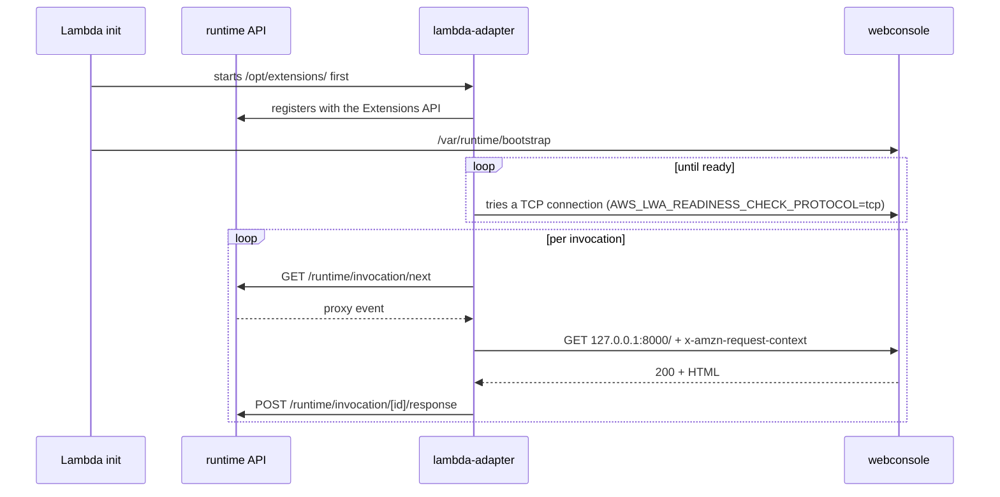
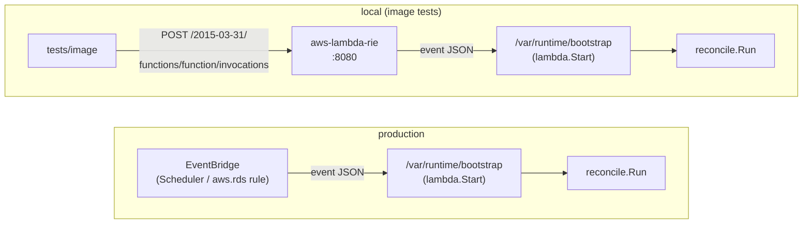
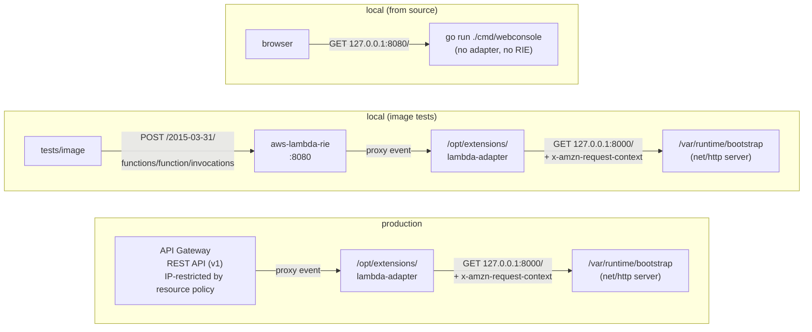

# Running on Lambda (RIE / LWA)

Both Lambda functions are deployed as container images, and in that form the connection to the Lambda runtime may be handled by the LWA or the RIE, which sit outside the application itself. What each is and where it appears are collected below.

| Name | What it is | Where it appears |
|---|---|---|
| LWA (Lambda Web Adapter) | An external extension bundled into the web console image | Both production and locally |
| RIE (Runtime Interface Emulator) | A stand-in for the Lambda execution environment, bundled in the base image | Locally only |

## Background: the Lambda runtime API and extensions

The Lambda execution environment exposes one HTTP API and passes its location in the `AWS_LAMBDA_RUNTIME_API` environment variable. The function side carries an implementation — a runtime — that spins the following loop.

1. Long-poll `GET /2018-06-01/runtime/invocation/next` to receive the next event
2. Process it
3. Return the result through `POST /2018-06-01/runtime/invocation/{requestId}/response` (or `.../error` on failure)

The base image `public.ecr.aws/lambda/provided:al2023` is the kind that expects the runtime to be brought along, and it executes `/var/runtime/bootstrap` at startup.

The other mechanism is external extensions. Executables under `/opt/extensions/` are started by init before the function's runtime and run alongside the function.

## Integration summary

How each component connects to the runtime API, and where the LWA and the RIE are in use, is collected below.

| Component | Connection to the runtime API | Lambda dependency in the app | LWA | RIE |
|---|---|---|---|---|
| reconciler | `lambda.Start` from `aws-lambda-go`, linked into the binary | One handler | Not included | Local image tests only |
| webconsole | The bundled LWA (`/opt/extensions/lambda-adapter`) | None; a plain `http.ListenAndServe` | Bundled | Local image tests only |
| cheapskate-cli | — | None; it does not run on Lambda | — | — |

The reconciler carries no LWA because it speaks the runtime API directly through `aws-lambda-go`. The web console links no Lambda runtime library at all and therefore carries no `lambda.norpc` build tag either.

## Lambda Web Adapter (LWA)

[awslabs/aws-lambda-web-adapter](https://github.com/awslabs/aws-lambda-web-adapter). An external extension for running an HTTP server as a Lambda function.

### Observable behaviour

The adapter starts first as an extension, waits for the application to become ready, and then spins the runtime API loop on its behalf.

The adapter's inputs and outputs are given below.

| Item | Content |
|---|---|
| Event formats accepted | API Gateway REST API v1, HTTP API v2, Function URL, or ALB. The adapter absorbs the difference |
| The original event's `requestContext` | Carried as a JSON string in the `x-amzn-request-context` header |
| The Lambda context | Carried in the `x-amzn-lambda-context` header |
| The application's response | Its status, headers, and body are turned back into the proxy response JSON and returned to the runtime API |

All the application sees is a single HTTP request arriving over the loopback. `RemoteAddr` is therefore always the adapter's loopback address and says nothing about where the request came from.

### The header that cannot be spoofed

`x-amzn-request-context` is rewritten by the adapter every time. A client may send a header of the same name, but it only lands in the event's `headers`, and the adapter replaces it with the value from the original event before handing the request to the application.

The web console takes the client IP from there. `identity.sourceIp` (REST API v1) or `http.sourceIp` (HTTP API v2 / Function URL) is the TCP peer of the connection to API Gateway itself, and it is the same value the resource policy's `aws:SourceIp` used to allow the request. With an IP allowlist as the only access control, what belongs in the log is the IP that was actually allowed, not what the client claims. `X-Forwarded-For` is ignored for the same reason: API Gateway appends the IP it observed at the end, so the client is free to write whatever it likes at the front.

That this substitution really happens can only be confirmed through the image. A unit test can go as far as showing that the header is read when present; the adapter re-establishing that header is the adapter's own behaviour.

### Integration into webconsole

What the `webconsole` stage of the `Dockerfile` does:

| What | Why |
|---|---|
| Copies the adapter executable into `/opt/extensions/`, pinned to an exact version | It is the only runtime dependency outside go.mod, so no other path would notice an update |
| `ENV PORT=8000 AWS_LWA_PORT=8000` | Makes the adapter's target and the server's listen port one contract held by the image itself. It is not 8080 because the RIE takes that port when it sits in front locally |
| `ENV AWS_LWA_READINESS_CHECK_PROTOCOL=tcp` | Makes readiness a matter of whether TCP connects. The default HTTP check issues a `GET /` on every cold start, which reads DynamoDB |

The application assumes LWA in two places, and without it both fall back to their local behaviour.

| Place | Assumption | Without it |
|---|---|---|
| `cmd/webconsole/main.go` | Listens on `PORT` when it is set | `-addr` (default `127.0.0.1:8080`) |
| `clientIP` in `internal/ui/webconsole` | Takes the client IP from `x-amzn-request-context` | `RemoteAddr`, with the port stripped |

## Runtime Interface Emulator (RIE)

A stand-in for the Lambda execution environment, bundled in the base image as `/usr/local/bin/aws-lambda-rie`. It never appears on the production path.

### Observable behaviour

On startup it listens on 8080, points `AWS_LAMBDA_RUNTIME_API` at itself, and starts the command given in its arguments as a child process. Posting a payload to `http://<host>:8080/2015-03-31/functions/function/invocations` feeds it to the runtime API as one invocation and returns the handler's response as the body of the HTTP response. The function name is fixed as `function`.

Like real Lambda, it starts the extensions under `/opt/extensions`, which is what makes the LWA path reachable locally. The function's logs reach the container log from stderr.

### Differences from the real thing

Where the RIE differs from the real Lambda execution environment is given below.

| Difference | Content |
|---|---|
| A handler returning an error still yields HTTP 200 | The failure appears in `errorMessage` / `errorType` in the body. The status code says only whether the invocation was possible |
| An open port does not mean invocations are accepted yet | The first call has to be waited for |
| Some features are missing | Authentication, billing, execution timeouts, concurrency control, delivery to CloudWatch Logs |

### How it is integrated

Nothing is added to the image. What the base image already carries is invoked only when running locally, and the production image does not override the entrypoint.

Only when it sits in front locally, the container's entrypoint is replaced with `/usr/local/bin/aws-lambda-rie` and the cmd with `/var/runtime/bootstrap`. This is needed only when the subject is a built image; it never appears on the path that starts the component from source.

## Comparing the paths

reconciler — LWA plays no part. The only difference from local is whether the runtime API is served by the Lambda execution environment or by the RIE.

webconsole — here too the only difference from production is the RIE inserted in front; from the adapter onwards the path is identical.

The RIE and the LWA enter the path in the image tests alone. Unit and integration tests call handlers and packages directly and pass through neither.
