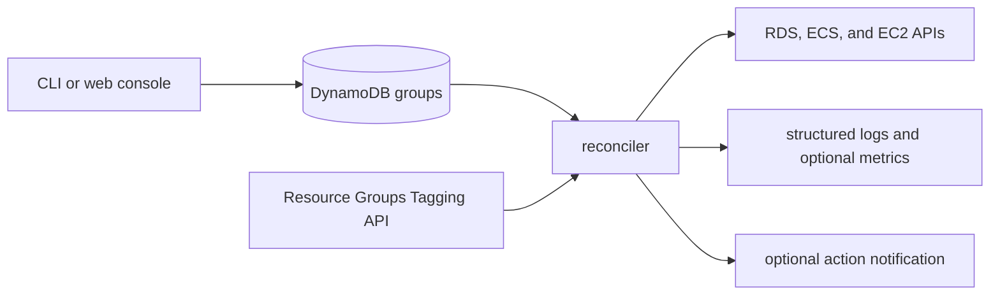

# Architecture overview

cheapskate is a convergent controller. It derives one desired state per configured group, associates tagged resources with those groups, observes each resource, and changes only stable resources that differ from the desired state.

The reconciler first completes the configuration Query and all `GetResources` pages. Resource operations begin only after both snapshots exist in memory. A configuration read or global discovery failure therefore aborts the cycle without changing resources.

Group and resource failures are isolated. They appear in the cycle summary and structured logs while other resources continue. No reconciliation history is persisted.

Concurrent invocations are allowed. Operations are at least once, and a later successful cycle converges resources to the newest configuration after invocations with older snapshots finish.
