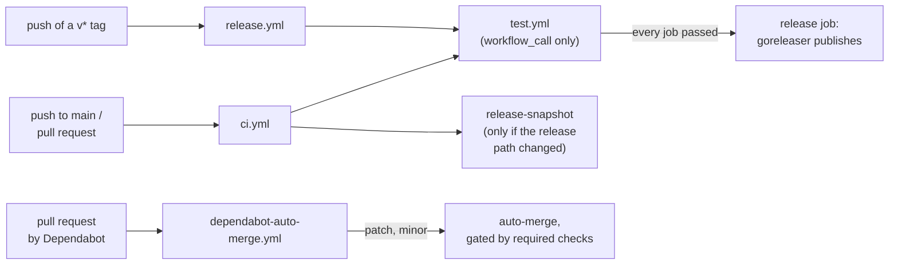

# GitHub Actions

CI, releases, and dependency updates all run on GitHub Actions from the definitions under `.github/`. This document covers each workflow's role, how they call one another, and what changing them brings about.

## Workflows

The definition files under `.github/` and their roles are collected below.

| Path | Trigger | Role |
|---|---|---|
| `workflows/ci.yml` | push to `main`, pull request | Calls `test.yml`, and snapshots the release path when that path changed |
| `workflows/test.yml` | Called by `ci.yml` and `release.yml` | lint, unit, integration, image tests, `goreleaser check` |
| `workflows/release.yml` | push of a `v*` tag | Calls `test.yml`, after which goreleaser publishes the GitHub release and the images |
| `workflows/dependabot-auto-merge.yml` | pull request | Queues Dependabot's patch and minor updates for auto-merge |
| `dependabot.yml` | weekly | Go modules, Actions, and Docker base images, grouped and held back by a 7-day cooldown |

`test.yml` has no trigger of its own (`workflow_call`). A release therefore runs the same checks a pull request does, against the tagged commit. The release job declares `needs: test`, so if any of them fails, no release is created for that tag and nothing is pushed to GHCR.

Every job runs on `ubuntu-latest` and takes the Go version from `go.mod`. The integration and image tests need no credentials: both the emulator and the Runtime Interface Emulator run on the runner's docker daemon.

## Composition

Drawing the call relationships from trigger to published artifact gives the following diagram.



## The release snapshot

`goreleaser check` validates the configuration but never builds, so it cannot see a broken `build/Dockerfile.*`. Only a snapshot does: it cross-compiles every target, assembles both images, and pushes nothing. It has to be `--snapshot` rather than `--skip=publish`, because dockers_v2 builds and pushes in one step and skipping publication skips the image build with it.

It is also the slowest thing in CI, at roughly six minutes against three for everything else combined, and nothing but a change to the release path can break it. The build therefore runs only when `.goreleaser.yaml`, `build/`, the root `Dockerfile`, or the module files changed. The job itself always runs: filtering it away with `on.paths` would leave a required check that never reports, and a pull request waiting on it forever. Instead the job reports either way and skips only its expensive steps.

The gap this leaves is a Go change that compiles on linux but not on the CLI's release platforms. `make lint` cross-compiles the CLI for darwin and windows, which closes it on every pull request and takes seconds with a warm build cache.

## Check names

`ci.yml` reaches most of its jobs through a reusable workflow, so those check names carry both levels: `test / lint`, `test / unit`, `test / integration`, `test / image`, and `test / goreleaser`. `release-snapshot` is a job of `ci.yml` itself and appears under that name.

Branch protection selects the required checks by these names, and whether Dependabot's auto-merge passes through a gate depends on which of them are selected. For what auto-merge needs from its side, see the auto-merge section in [release.md](release.md).

## Token permissions

Every workflow declares `permissions: contents: read` at the top and raises it only in the jobs that need it, so write access exists only while it is needed. The release job holds `contents: write` and `packages: write`, and the auto-merge job holds `contents: write` and `pull-requests: write`.

Runs triggered by Dependabot are the one case with different defaults. Whatever the workflow asks for, `GITHUB_TOKEN` is read-only and the Actions secrets are out of reach. What raises it to the level merging needs is the job-level `permissions`.

## Pinning actions by SHA

Every action is pinned to a full commit SHA rather than a tag, with the corresponding version left in a trailing comment. The form is as follows.

```yaml
- uses: actions/checkout@3d3c42e5aac5ba805825da76410c181273ba90b1 # v7.0.1
```

A tag is a mutable reference. Anyone with admin rights on an action's repository can repoint `v7` at different code, and every workflow referring to it picks that up on its next run with nothing changing here. A SHA cannot be repointed. The difference matters most for the release workflow, which holds `contents: write` and `packages: write`, and for the auto-merge workflow, which holds write access and merges with nobody in the loop.

The trailing comment is Dependabot's input: it reads the comment, updates the SHA when a new version appears, and rewrites the comment. A pin therefore does not go stale. The exception is `uses: ./.github/workflows/test.yml`, since a local reusable workflow resolves against the running commit and there is nothing to pin.

## Changes whose effects go unnoticed

The changes to a workflow that leave the run succeeding while quietly losing its effect are collected below.

| Change | What follows |
|---|---|
| Reverting an action reference from a SHA to a tag | The reference becomes mutable again and can be repointed at different code with nothing landing in this repository |
| Renaming a job in `test.yml` | Branch protection selects required checks by name, so the renamed job stops being required and the merge gate opens without any failure showing |
| Adding a job to `test.yml` | `release.yml` calls the same workflow, so a release takes the same extra time |
| Removing `cooldown` from `dependabot.yml` | Versions published moments ago become eligible and reach `main` through auto-merge without review |
| Filtering `release-snapshot` with `on.paths` instead of the internal condition | The check stops reporting on pull requests that do not match, and a pull request requiring it waits forever on a result that never arrives |

## Parts outside `.github/`

The rest of the release path lives outside `.github/`. The `.goreleaser.yaml` at the repository root defines what a release produces, and `build/Dockerfile.reconciler` and `build/Dockerfile.webconsole` assemble the published images.
