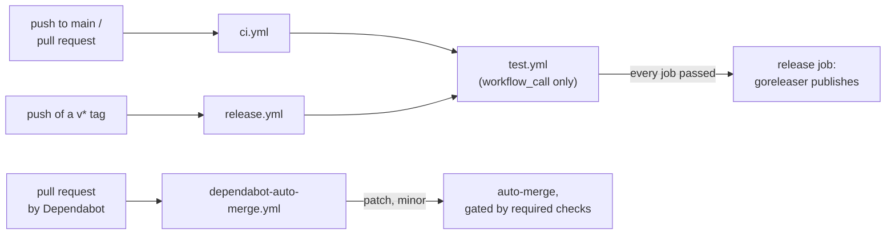

# GitHub Actions

CI, releases, and dependency updates all run on GitHub Actions, out of `.github/`. This page covers the workflows themselves: what each one is, how they fit together, and what breaks when they are edited. Cutting a release, what a release produces, and the reasoning behind the dependency-update settings are in [release.md](release.md).

## Workflows

| Path | Trigger | Role |
|---|---|---|
| `workflows/ci.yml` | push to `main`, pull request | calls `test.yml` |
| `workflows/test.yml` | called by `ci.yml` and `release.yml` | lint, unit, integration, image tests, goreleaser check and snapshot build |
| `workflows/release.yml` | push of a `v*` tag | calls `test.yml`, then goreleaser publishes the GitHub release and the images |
| `workflows/dependabot-auto-merge.yml` | pull request | queues Dependabot's patch and minor updates for auto-merge |
| `dependabot.yml` | weekly | Go modules, Actions, and Docker base images, grouped, held back by a 7-day cooldown |

`test.yml` has no trigger of its own (`workflow_call`), so a release runs the same checks a pull request runs, on the tagged commit. The release job declares `needs: test`: a failure anywhere in it leaves the tag without a release, and nothing is pushed to GHCR.

Every job runs on `ubuntu-latest` with the Go version taken from `go.mod`. The integration and image jobs need no credentials — the emulator and the Runtime Interface Emulator both come from the runner's docker daemon ([test.md](test.md)).

## Structure



## Check names

Because `ci.yml` reaches its jobs through a reusable workflow, each check carries both levels in its name: `test / lint`, `test / unit`, `test / integration`, `test / image`, `test / goreleaser`. Branch protection selects required checks by these names, and the auto-merge path is only gated as long as they are the ones selected ([release.md](release.md)).

## Token permissions

Each workflow sets `permissions: contents: read` at the top and raises it per job, so a job holds write access only for as long as it needs it: `contents: write` and `packages: write` for the release job, `contents: write` and `pull-requests: write` for the auto-merge job.

Runs triggered by Dependabot are the exception to the default: they get a read-only `GITHUB_TOKEN` and no access to Actions secrets, whatever the workflow asks for. The job-level `permissions` block is what raises it to the level the merge needs.

## Pinned actions

Every action is pinned to a full commit SHA rather than a tag, with the version it corresponds to in a trailing comment:

```yaml
- uses: actions/checkout@3d3c42e5aac5ba805825da76410c181273ba90b1 # v7.0.1
```

A tag is a movable pointer: whoever controls the action's repository can repoint `v7` at different code, and every workflow referencing it picks that up on the next run without any change landing here. A SHA cannot be repointed. This matters most for the release workflow, which holds `contents: write` and `packages: write`, and for the auto-merge workflow, which holds a write token and merges without a human.

The comment is not decoration — Dependabot reads it, bumps the SHA when a new version is released, and rewrites the comment to match, so pinning does not mean going stale. The one exception is `uses: ./.github/workflows/test.yml`: a local reusable workflow resolves at the commit being run, so there is nothing to pin.

## What breaks quietly

| Change | Consequence |
|---|---|
| An action reference moved from a SHA back to a tag | The reference becomes movable again, and other code can be substituted for it without anything landing in this repository |
| A job in `test.yml` renamed | Branch protection selects required checks by name, so the renamed job stops being required and the merge gate opens without any visible failure |
| A job added to `test.yml` | Every release pays for it too, since `release.yml` calls the same workflow |
| `cooldown` dropped from `dependabot.yml` | A version published minutes ago becomes eligible, and the auto-merge path carries it to `main` without review |

## Elsewhere in the repository

The remainder of the release path lives outside `.github/`: `.goreleaser.yaml` at the repository root defines what a release produces, and `build/Dockerfile.reconciler` and `build/Dockerfile.webconsole` assemble the images it publishes.
