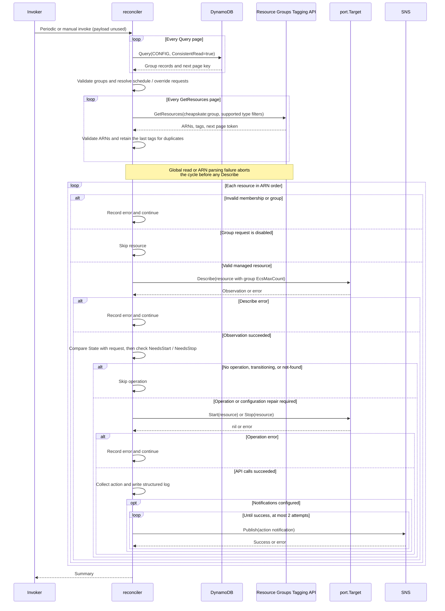
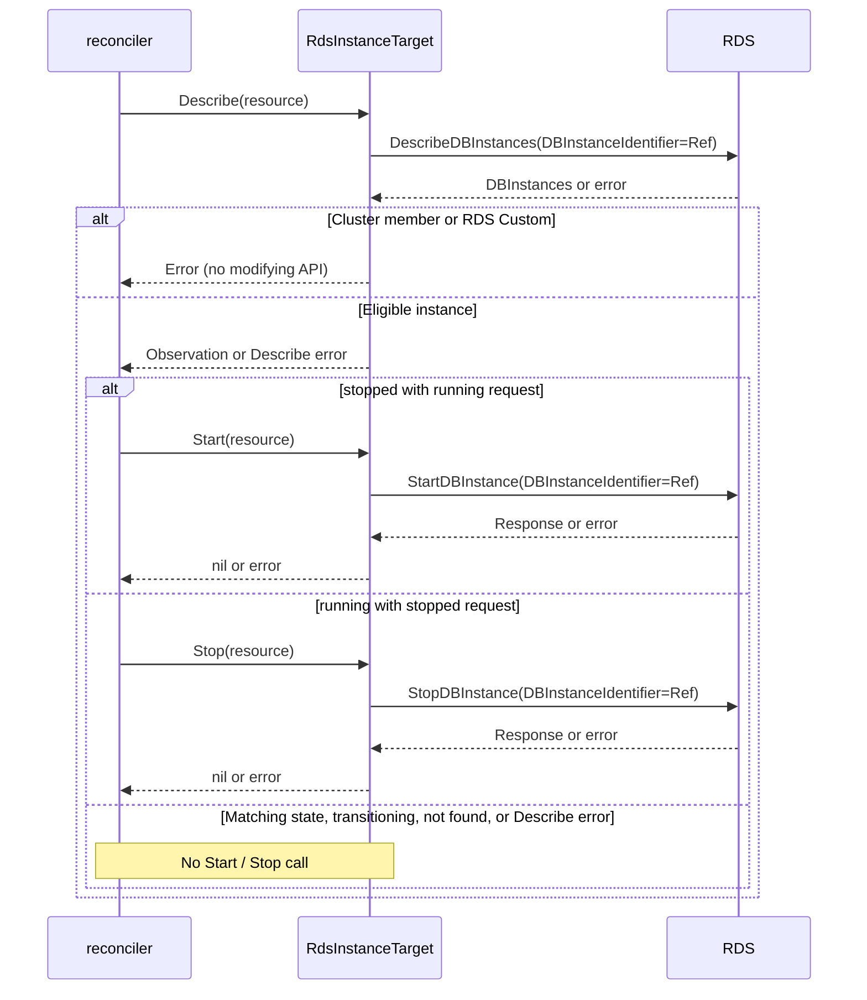
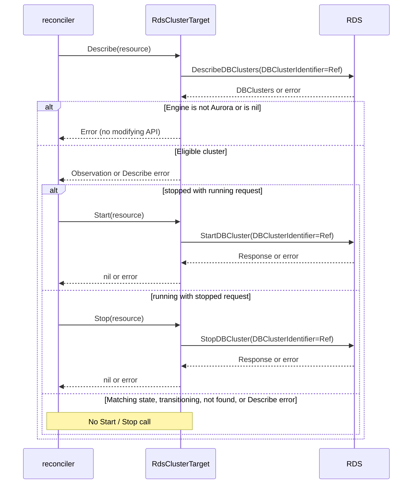
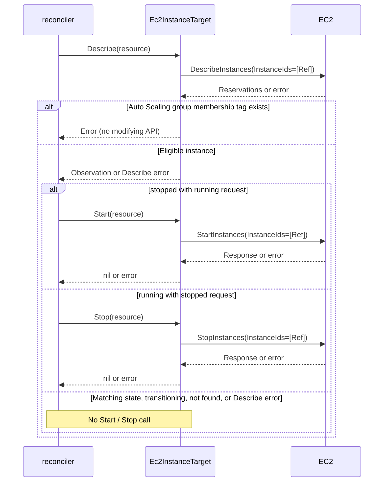
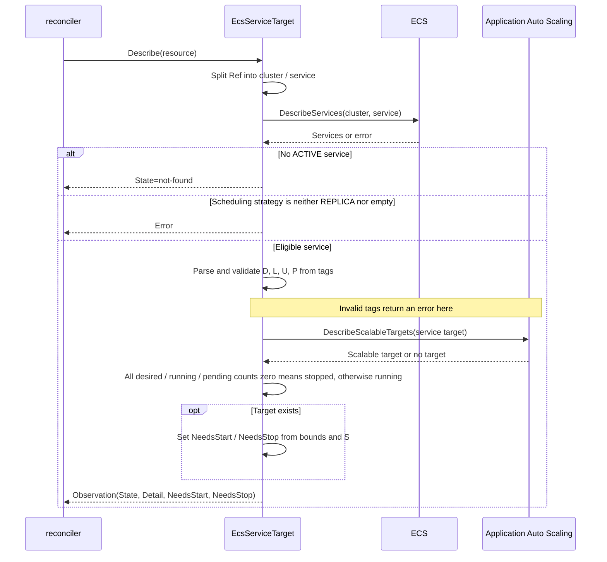
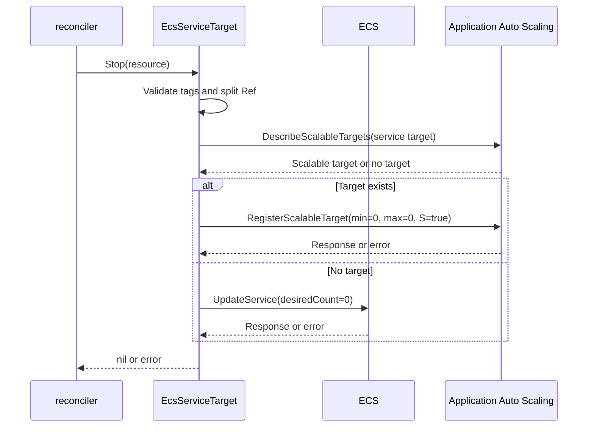
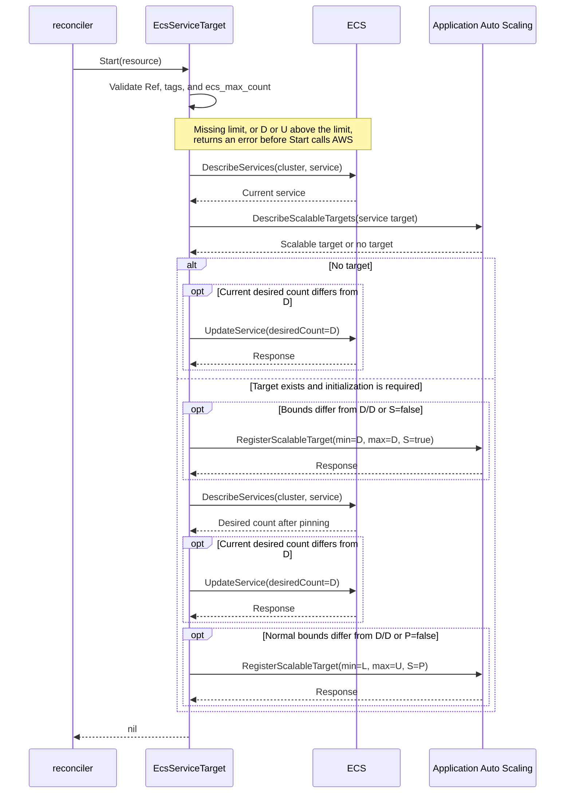
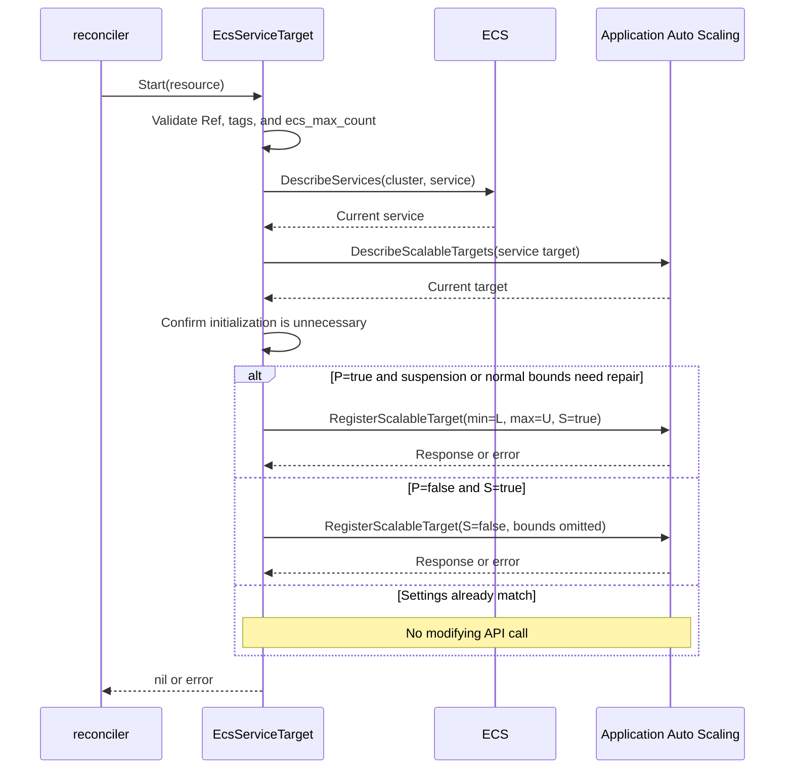
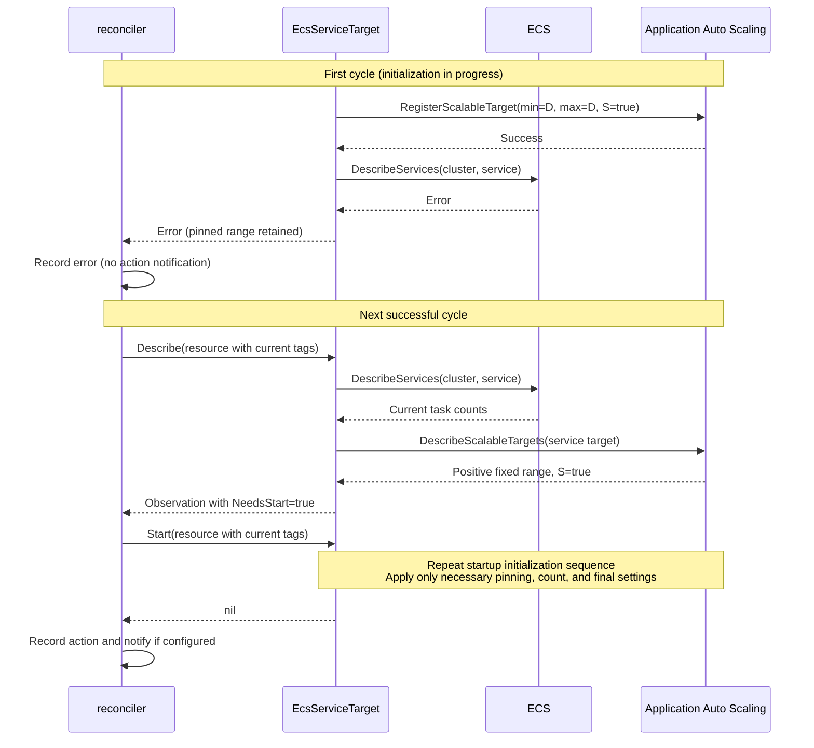

# Resource operation sequences

This document describes calls between the reconciler and resource adapters, AWS API branches, and configuration repair conditions. It includes inputs and observations needed to read the implementation. Diagrams omit retries performed within the AWS SDK.

## Common reconcile cycle

A cycle loads all groups and discovery results before processing resources in ARN order. A disabled group does not receive even an adapter Describe call. The sequence from configuration loading to operation results is:

Notification failure is logged without reversing a successful operation. Start or Stop success does not imply that the resource transition has completed; a later cycle observes it again. No action history, checkpoint, or AWS settings snapshot is written to DynamoDB.

For global failure boundaries and overlapping invocations, see [Reconcile boundaries](reconcile.md). For the implementation, see the [reconciler](../../../internal/app/reconcile/reconcile.go) and [resource discovery](../../../internal/aws/tagging/tagging.go).

## RDS DB instances

Instances with a nonempty DBClusterIdentifier or an engine beginning with custom- are rejected. The sequence from Describe to modifying APIs is:

DBInstanceStatus available maps to running, stopped to stopped, and every other status to transitioning. DBInstanceNotFoundFault, an empty response, or no instance with an observable status yields not-found. Entries with nil DBInstanceStatus are not used for state classification.

For the implementation, see the [RDS adapter](../../../internal/aws/compute/rds.go).

## Aurora DB clusters

Only clusters whose engine begins with aurora are eligible. The cluster sequence is:

Status available maps to running, stopped to stopped, and every other status to transitioning. DBClusterNotFoundFault, an empty response, or no cluster with an observable status yields not-found. Entries with nil Status are not used for state classification. No modifying API is called for member DB instances.

For the implementation, see the [RDS adapter](../../../internal/aws/compute/rds.go).

## EC2 instances

An instance is rejected if its DescribeInstances tags contain aws:autoscaling:groupName. The instance sequence is:

State.Name running and stopped map to the corresponding observations. terminated and InvalidInstanceID.NotFound map to not-found; other states map to transitioning. An empty response or only instances with nil State also yields not-found.

For the implementation, see the [EC2 adapter](../../../internal/aws/compute/ec2.go).

## ECS services

ECS observes scalable-target settings as well as task counts. Configuration tags come from the discovery snapshot and are validated again by Start and Stop. The following symbols are used in the sequences:

| Symbol | Meaning |
| --- | --- |
| D | Startup desired-count after tag defaults |
| L / U | Normal scaling-min / scaling-max after tag defaults |
| P | scheduled-scaling-paused request; absent means false |
| S | AWS ScheduledScalingSuspended; absent or nil means false |

The scalable target is identified by ServiceNamespace=ecs, ResourceId=service/{cluster}/{service}, and ScalableDimension=ecs:service:DesiredCount. Every RegisterScalableTarget specifies only ScheduledScalingSuspended and omits DynamicScalingInSuspended and DynamicScalingOutSuspended. Scheduled action definitions are neither read nor written.

### Observation

The sequence returning task state and repair requests is:

Ref splitting failures and DescribeServices failures also return errors. Detail contains task counts and, when a target exists, bounds and actual S. Without a target, neither NeedsStart nor NeedsStop is set.

Repair conditions are listed below. Both flags can be true; the reconciler uses only the flag corresponding to the group's desired state.

| Flag | Condition |
| --- | --- |
| NeedsStop | Bounds differ from 0/0 or S=false |
| NeedsStart | All task counts zero, bounds 0/0, or an incomplete startup range |
| NeedsStart | S differs from P |
| NeedsStart | P=true and bounds differ from L/U |

An incomplete startup range has S=true, positive equal minimum and maximum, and differs from L/U. The fixed value need not match current D. With P=false during normal operation, Scheduled Scaling changes to bounds do not trigger repair.

### Stop

Stop validates tags and reads the target again. The stop sequence is:

Stop applies S=true regardless of P and never changes P. It does not reject stopping based on ecs_max_count. With a target, there is no additional UpdateService or rollback.

### Startup initialization

Start validates Ref, tags, and ecs_max_count before rereading the service and target. The sequence for a stopped service, bounds of 0/0, or an incomplete startup range is:

This diagram shows the successful path. Any API failure stops subsequent calls and returns an error. A missing service or unsupported strategy also returns an error. The second observation accounts for RegisterScalableTarget adjusting capacity to fit its bounds.

P=false resumes only in the final RegisterScalableTarget. If P=true and L=U=D, the initial pin also satisfies normal configuration, so the final RegisterScalableTarget is omitted. For running services that need no initialization, Start uses the following repair sequence.

### Running configuration repair

For a service that needs no startup initialization, Start reapplies only suspension configuration. The sequence is:

UpdateService is not called, and desired count is not reset to startup capacity. A flag-only RegisterScalableTarget can still adjust capacity if it is outside current bounds. Bounds of 0/0 or an incomplete startup range select initialization instead of this sequence.

### Partial failures and later cycles

When startup pinning produces a range different from the normal tag bounds and the following ECS observation fails, recovery follows this sequence:

A true suspension request alone is not evidence of incomplete startup. Failure states and subsequent repairs are:

| Remaining state | Later cycle |
| --- | --- |
| Stop configuration not applied | Repair bounds or S differences |
| Incomplete startup range | Initialize using current D, L/U, and P |
| L=U=D with only S differing from the request | Repair the flag difference |
| Final response lost, P=true, normal settings match | No additional operation |
| Final response lost, P=false, Scheduled Scaling subsequently changed bounds | Preserve the changed range |

An invocation holding an old snapshot can apply an old request. A successful later cycle converges to the latest request after the old invocation finishes. Disabling management, exiting management, and stopping execution of cheapskate itself do not restore applied AWS flags or bounds.

For the implementation, see the [ECS adapter](../../../internal/aws/compute/ecs.go). For failure recovery and configuration persistence checks, see the [existing ECS tests](../../../internal/aws/compute/ecs_test.go) and [Scheduled Scaling tests](../../../internal/aws/compute/ecs_scheduled_scaling_test.go).
