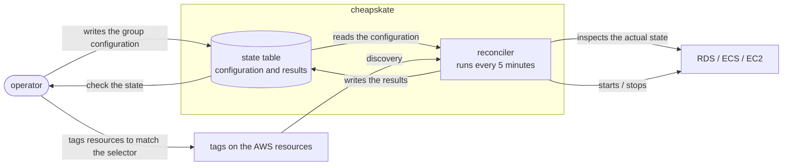

# Terms and the overall picture

cheapskate is a tool for registering the state AWS resources ought to be in and keeping their actual state in line with it. This document shows the overall flow and defines the terms used across the usage documents.

## The overall flow

Drawing the flow from entering the configuration to the actual state changing gives the following diagram.

Both a configuration change and adding or removing a tag take effect from the next reconcile cycle. When the desired state and the actual state already agree, no operation is performed on the resource.

## Terms

The terms used from here on are given below.

| Term | Meaning |
| --- | --- |
| Target group (group) | The unit of configuration. It holds how the desired state is decided and the selector that picks the resources |
| Selector | The condition that picks what is managed: an AWS tag key/value plus the target resource types |
| Discovery | Finding the resources matching a selector from the AWS tags. Individual resources are never registered |
| Desired state | The state a group's resources ought to be in: `running` or `stopped` |
| Reconcile (convergence) | Comparing the desired state with the actual state and starting or stopping to bring them together |
| Reconcile cycle | One pass of reconcile over every group. Every 5 minutes by default |
| Reconciler | The Lambda function that runs the reconcile cycle. The only component that starts or stops AWS resources |
| Pin | Fixing the desired state to one value without using a schedule |
| Disable | Excluding a group from reconcile |
| Override | A time-limited replacement of the desired state |
| State table | The DynamoDB table holding the configuration and the results |
| Status record | The results the reconciler writes: the last action, the last error, and any ongoing transition |
| Transitioning | Being partway through a start or stop. The reconciler leaves the resource alone and waits for the next cycle |
| Orphaned record | A record in the state table whose group or resource no longer exists |
