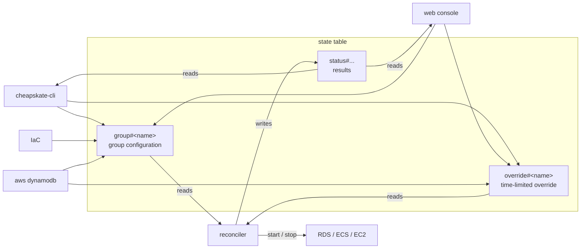

# Operating the configuration records

cheapskate's configuration is nothing but the records held in the DynamoDB state table. This document covers how to add, change, inspect, and delete those records, and what can be configured in them.

Drawing the ways of writing, the records themselves, and their relationship with the reconciler gives the following diagram.



There are four ways to write: `cheapskate-cli`, the web console, IaC, and `aws dynamodb`. All of them read and write the same records, and none is more capable than or exclusive of another.

There is no record-side operation for making a resource a member of a group. Apply a tag matching the group's selector to the AWS resource. For details, see the selector tags in [resource_tag.md](resource_tag.md).

## What the records configure

### `group#<name>` — group configuration

The attributes that can be set are given below.

| Attribute | Value | Meaning |
| --- | --- | --- |
| `mode` | `pinned` \| `schedule` \| `disabled` | How the desired state is decided. Unset is treated as `disabled` |
| `desired` | `running` \| `stopped` | The desired state under `mode=pinned`. Required for `pinned` |
| `start_cron` | A five-field cron (for example `0 9 * * MON-FRI`) | The start time under `mode=schedule` |
| `stop_cron` | A five-field cron | The stop time under `mode=schedule` |
| `timezone` | An IANA name (for example `Asia/Tokyo`) | Used to evaluate the crons. Unset falls back to the reconciler's `DEFAULT_TIMEZONE` |
| `tag_key` / `tag_value` | Any string | The selector's tag. Both are required (an empty value is rejected), and a key starting with `aws:` is rejected |
| `types` | A string set of `rds-instance` `rds-cluster` `ecs-service` `ec2-instance` | The resource types the selector targets. One or more |

- A group name matches `[A-Za-z0-9][A-Za-z0-9._-]{0,63}` (`#` and `/` are not allowed)
- `start_cron` and `stop_cron` may be given on their own (a start-only or stop-only schedule)
- A group with `mode` set to `pinned` or `schedule` must have a selector

Setting `pinned` or `schedule` while the selector is missing is recorded as a configuration error on `status#group#<name>`.

#### Timezones with daylight saving

In a `timezone` that observes daylight saving (DST), place the crons at times outside the changeover band (01:00–03:00 in most regions). Crons are evaluated against the local wall clock, so one placed at a time that the spring-forward removes does not fire that day. A `start_cron` that does not fire leaves the group stopped for the day; a `stop_cron` that does not fire leaves it running until the next stop.

> [!NOTE]
> A time that occurs twice under the autumn fall-back may fire twice, but the desired state is the same on both firings, so nothing is affected.

### `override#<name>` — a time-limited override

The attributes that can be set are given below.

| Attribute | Value | Meaning |
| --- | --- | --- |
| `desired` | `running` \| `stopped` | This state takes precedence until the expiry |
| `expires_at` | epoch seconds | When it expires. It is also the table's TTL attribute |

An override applies to every resource matching the group's selector. An expired override is ignored.

### Precedence

When several settings hold at once, the order of precedence is given below. Earlier rows win.

| Precedence | Condition | Desired state |
| --- | --- | --- |
| 1 | `mode=disabled` | Undecided. The whole group leaves the managed set |
| 2 | An unexpired override exists | The override's `desired` |
| 3 | `mode=pinned` | The group's `desired` |
| 4 | `mode=schedule` | Whichever of `start_cron` / `stop_cron` fired later in the past. On a tie, stop |

`mode=disabled` is stronger than an override, so registering an override on a disabled group is rejected.

When the desired state and the actual state agree, no record is written and nothing is notified. A resource that is transitioning (starting/stopping) is left until the next cycle.

## Adding

A group's record is created by `set-selector`. It starts out as `mode=disabled`, so the order is to write the configuration and then enable it.

```console
export CHEAPSKATE_TABLE=<state-table-name>
cheapskate-cli set-selector --group dev --tag-key cheapskate:group --tag-value dev --types rds-cluster,ecs-service,ec2-instance
```

On an existing group, only the selector is replaced; `mode`, `desired`, the crons, and `timezone` are kept. The web console offers the same operation as a form on the list page.

Writing the raw record directly looks as follows.

```console
aws dynamodb put-item --table-name <state-table-name> --item '{
  "pk":        {"S": "group#dev"},
  "mode":      {"S": "pinned"},
  "desired":   {"S": "stopped"},
  "tag_key":   {"S": "cheapskate:group"},
  "tag_value": {"S": "dev"},
  "types":     {"SS": ["rds-cluster"]}
}'
```

In Terraform, `group#` can be managed with `aws_dynamodb_table_item`. The reconciler never writes to `group#`, so no drift occurs.

## Changing

The attributes each command rewrites and those it keeps are collected below. All of them apply to an existing group only; no command creates a new group.

| Command | Attributes rewritten | Attributes kept |
| --- | --- | --- |
| `set-selector --group G --tag-key K --tag-value V --types T` | `tag_key` / `tag_value` / `types` | `mode`, `desired`, the crons, `timezone` |
| `pin --group G stopped\|running` | `mode=pinned` + `desired` | The crons, `timezone`, the selector |
| `unpin --group G` | `mode=schedule` if crons exist, otherwise `disabled` | Everything else |
| `schedule --group G -start C1 -stop C2 -timezone TZ` | `mode=schedule` + the crons + `timezone` | The selector (`desired` is dropped) |
| `disable --group G` | `mode=disabled` | Everything else |
| `override --group G running -for 2h` | Creates `override#` (`desired` + `expires_at`) | `group#` is left untouched |
| `clear-override --group G` | Deletes `override#` immediately | `group#` is left untouched |

```console
cheapskate-cli pin --group dev stopped                                              # always stopped (RDS 7-day auto-starts are stopped again)
cheapskate-cli schedule --group dev -start "0 9 * * MON-FRI" -stop "0 20 * * MON-FRI" -timezone Asia/Tokyo
cheapskate-cli override --group dev running -for 2h                                 # temporary start (expires through the TTL)
cheapskate-cli clear-override --group dev
cheapskate-cli disable --group dev                                                  # stop managing without losing the configuration
```

Invalid values (a cron, a timezone, `desired`, a resource type, a `-for` of zero or less) are rejected before anything is written. The web console offers the same operations as forms on the group page.

An override disappears through the TTL and is therefore not suited to IaC management.

## Inspecting

Three commands read out the current configuration and actual state. None of them writes.

```console
cheapskate-cli list                 # group# + override# + status#group# for every group
cheapskate-cli show --group dev     # the same for one group + the resources matching the selector (with status and current state)
cheapskate-cli doctor               # diagnoses table inconsistencies and leftover records (read-only)
```

Every command writes exactly one JSON object to stdout. Nothing has to be parsed line by line; it can go straight into `jq`. On failure it writes `{"error": "..."}` to stderr and exits 1. The only non-JSON output is the usage text (`cheapskate-cli -h`).

Some output, and an example of shaping it with `jq`, are given below.

```console
$ cheapskate-cli pin --group dev stopped
{
  "command": "pin",
  "group": "dev",
  "mode": "pinned",
  "desired": "stopped"
}

$ cheapskate-cli list | jq -r '.groups[] | select(.mode == "schedule") | .name'
dev

$ cheapskate-cli show --group dev | jq -c '.resources[] | {ref, live: .live.state}'
{"ref":"dev-cluster/api","live":"running"}
```

The output of each command is given below.

| Command | Output |
| --- | --- |
| `list` | `{"command": "list", "groups": [...]}`. Each group carries `name`, its configuration (`mode`, `desired`, the crons, `timezone`, `selector`), `override` (with `expires_at` as RFC3339 UTC), and `status`. A broken record lands in that group's `error`, and the other groups are printed as usual |
| `show` | `{"command": "show", "group": {...}, "resources": [...]}`. `group` has the same shape as in `list`. `resources` is always an array, each element carrying `type`, `ref`, `arn`, `status`, `live` (the current state), and `config` (the settings from the resource's tags). A discovery failure adds `discover_error` and still exits 0 |
| Mutating commands | Return `command`, `group`, and only what the command wrote. The group is not read back in full |
| `doctor` | `{"command": "doctor", "findings": [...], "pruned": 0, "counts": {...}}`. For the meaning of each finding, see the `doctor` diagnosis in [troubleshooting.md](troubleshooting.md) |

The values on `status#` are a snapshot taken when the last action or error occurred, not a live state. For the current state, use `live` from `show` or the group page of the web console. The exception is `transitioning_since`, which holds when an ongoing transition started and disappears once the transition resolves.

A resource's last error is recorded in `last_error` on `status#`, and group-level problems (an invalid cron, a discovery failure, a selector collision) on `status#group#<name>`. Removing the cause clears them on the next cycle.

In the web console, the list page shows every group on one row, and the group page lists the matching resources.

## Deleting

Two commands delete a group's configuration. They differ in scope.

```console
cheapskate-cli remove --group dev          # deletes override# → status#group# → group#, in that order
cheapskate-cli clear-override --group dev  # deletes override# only
```

Deletion never touches an AWS resource. Afterwards the resources are no longer managed by cheapskate and stay exactly as cheapskate last left them.

> [!CAUTION]
> Unless leaving them stopped and unmanaged is the intent, start them with `override running` before `remove` and wait one cycle. An ECS service unmanaged while stopped is left at desiredCount 0 with Auto Scaling 0-0, and there is no way to put it back from cheapskate. For the recovery procedure, see the ECS-specific notes in [troubleshooting.md](troubleshooting.md).

The per-resource `status#` records remain. So do those for resources that no longer match a selector, with no effect on behaviour.

```console
cheapskate-cli doctor --prune   # deletes orphaned records only (touching neither the configuration nor the AWS resources)
```

To delete a single one by hand, the `pk` in each `doctor` finding serves as the key directly.

```console
aws dynamodb delete-item --table-name <state-table-name> --key '{"pk":{"S":"status#ecs-service#dev-cluster/api"}}'
```

To stop managing a group only temporarily, use `disable` rather than deletion; the configuration stays. Note that a disabled group accepts no override, so starting it later means returning it to `pin` or `schedule` first.

## IAM permissions required

The permissions needed by the principal running `cheapskate-cli` or the web console are given below. No start/stop API permission is required.

| Permission | Purpose |
|---|---|
| `dynamodb:Scan` / `GetItem` / `PutItem` / `DeleteItem` on the state table | Reading and writing the records |
| `tag:GetResources` | Listing the resources matching a selector |
| `Describe*` on RDS/ECS/EC2 | The current state in `show` and on the group page |

Without `tag:GetResources`, `doctor` reports a discovery error and withholds the orphan verdict.
