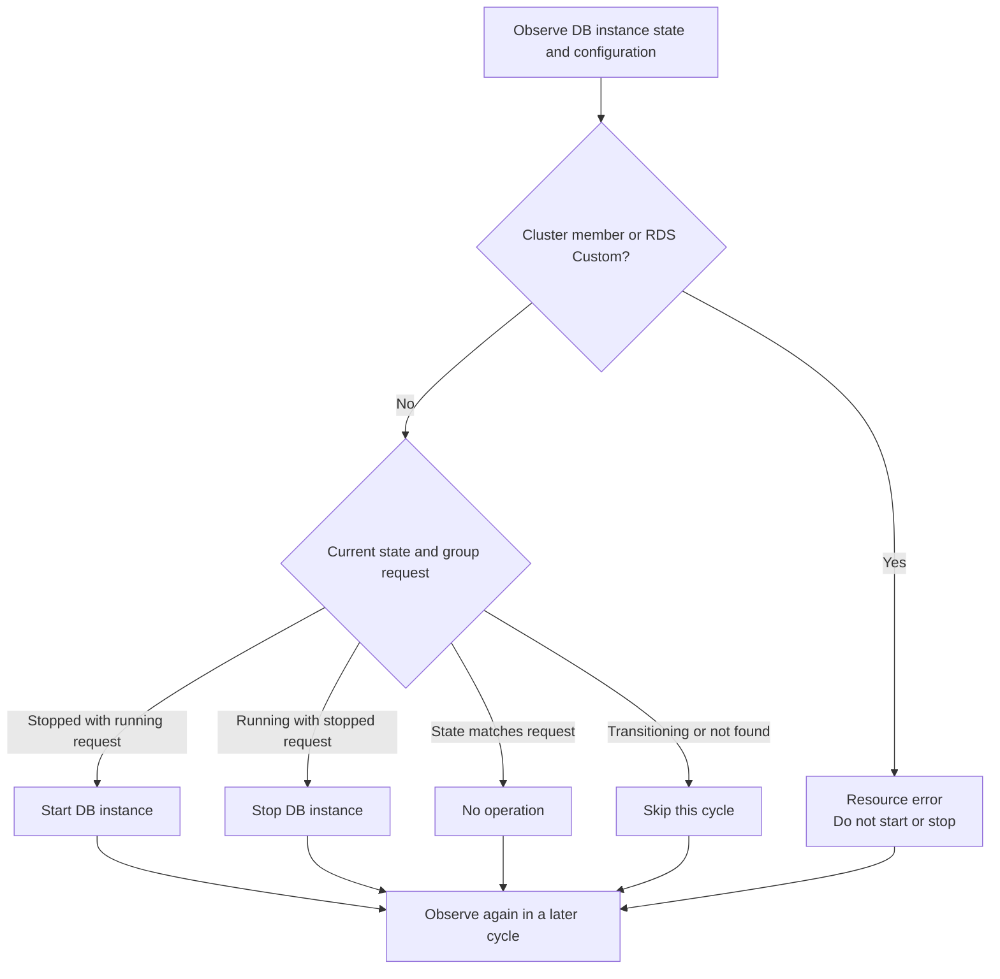
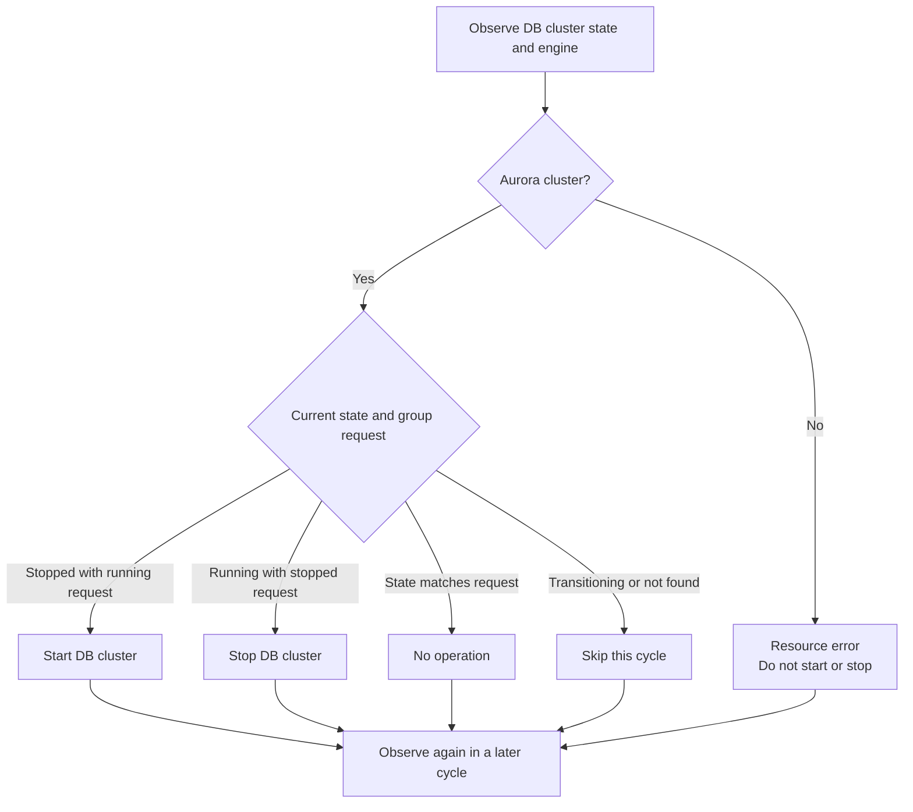
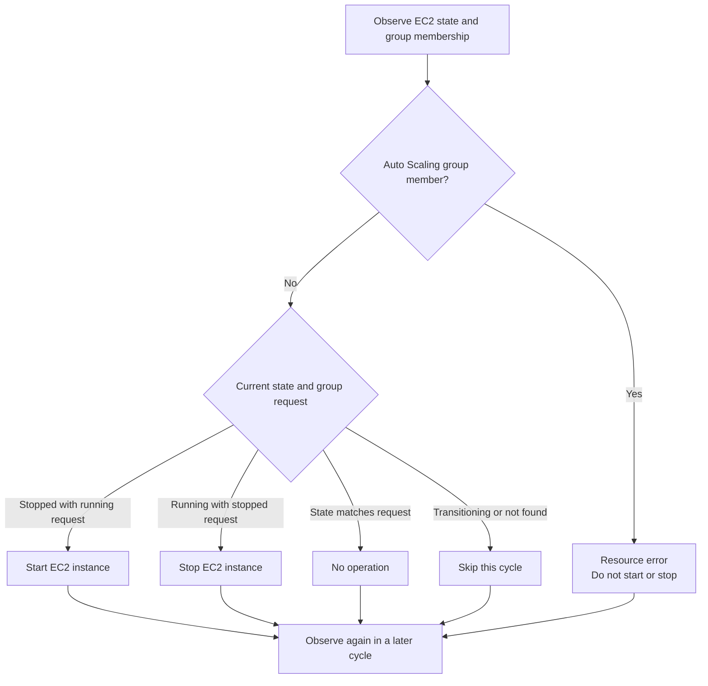
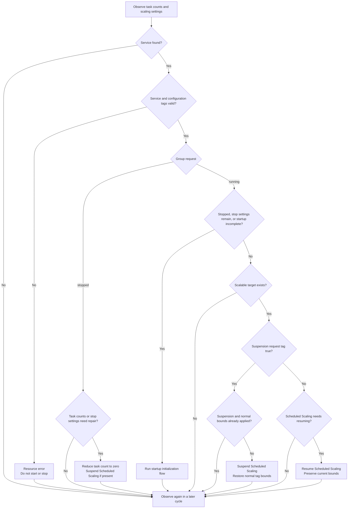
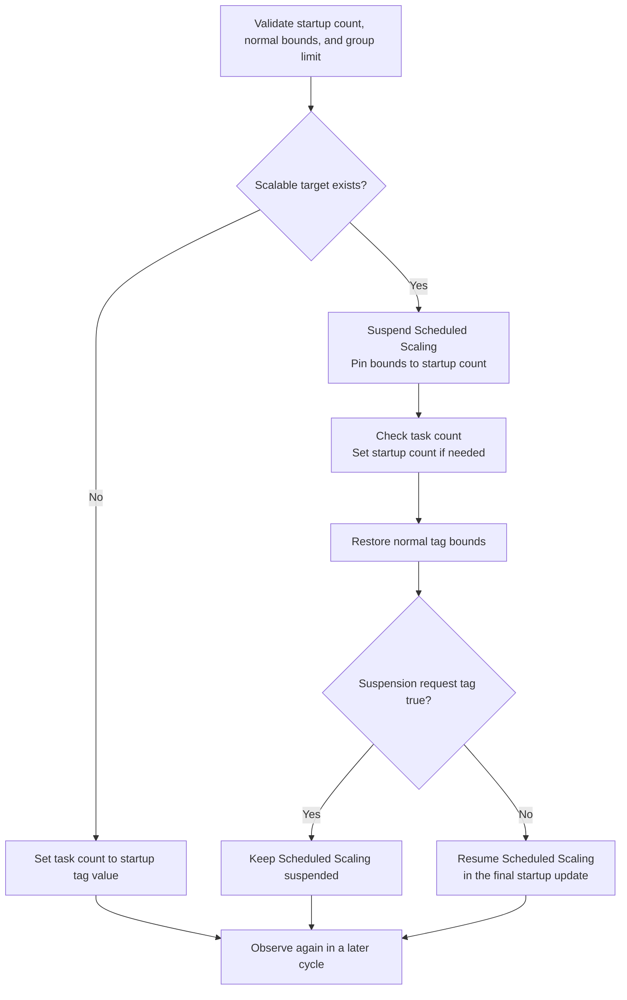

# Resource processing flows

This document outlines how cheapskate starts and stops RDS DB instances, Aurora DB clusters, EC2 instances, and ECS services.

## Common processing

cheapskate normally runs every five minutes and derives resource requests from group configuration and membership tags. A failure to load all group configuration or discover all resources prevents resource operations in that cycle. Invalid membership or group configuration is reported as a resource error.

Group requests have the following effects:

| Request | Behavior |
| --- | --- |
| `running` | Converge the managed resource to its running state |
| `stopped` | Converge the managed resource to its stopped state |
| `disabled` | Do not observe, start, or stop the resource |

The following diagrams describe one cycle for a resource with automatic control enabled. Starting and stopping refer to the managed AWS resource. Stopping execution of cheapskate itself leaves applied AWS settings in place and prevents new requests and repairs from being applied.

A start or stop operation ends for that cycle when AWS accepts it. cheapskate does not wait for the resource transition to finish; a later cycle observes its state again. After an operation fails, later cycles also compare the current request and resource state again.

For schedule and override resolution, see [Concepts](concepts.md).

## RDS DB instances

Eligible instances are not cluster members and do not use RDS Custom. The instance flow is:

RDS status `available` is treated as running, `stopped` as stopped, and other statuses as transitioning.

## Aurora DB clusters

Aurora is managed as a DB cluster. Do not register its member DB instances as individual stop targets. The cluster flow is:

RDS status `available` is treated as running, `stopped` as stopped, and other statuses as transitioning.

## EC2 instances

Eligible instances do not belong to an Auto Scaling group. The instance flow is:

`running` and `stopped` map to their corresponding states. `terminated` is treated as not found and is never restarted. Instances that are starting or stopping are skipped.

## ECS services

Stopping an ECS service means reducing its task count to zero. It is considered stopped only when desired, running, and pending counts are all zero. Otherwise it is considered running, and stop configuration can be applied even while tasks are draining.

Only `REPLICA` services are eligible. Invalid configuration tags prevent starts and stops. Both startup initialization and running configuration changes require validation against the group's `ecs_max_count` limit.

### Operations and configuration repair

In addition to task counts, ECS processing observes Scheduled Scaling suspension and capacity bounds. Its branches are:

With a scalable target, stop settings are bounds of `0/0` and Scheduled Scaling suspension. Without a target, only task count changes. Even with a `false` tag, Scheduled Scaling stays suspended while cheapskate requests that the ECS service remain stopped.

During normal operation with a `true` request, normal tag bounds are maintained. With a `false` request, Scheduled Scaling may change bounds. Running configuration changes do not reset desired count to startup capacity, although applying bounds may adjust a count outside that range.

Without a scalable target, suspension repair is unnecessary. A suspended positive fixed range that differs from normal tag bounds is treated as incomplete startup.

### Startup initialization

The startup flow for a stopped service, bounds of `0/0`, or an incomplete startup range is:

The normal bounds and final suspension request shown in the diagram are applied together. Completing startup configuration does not mean all tasks have finished starting. An intermediate failure leaves applied settings in place so a later cycle can recover using the current tags.

A `true` suspension request persists across repeated service starts and stops. Scheduled Scaling suspension does not suspend every kind of automatic scaling while the service is running.

If Scheduled Scaling reduces all task counts to zero while the group requests `running`, a later cycle starts the service again. Use cheapskate schedules or a `stopped` override for periods that must remain at zero.

For configuration tags and bounds ownership, see [Resource tags](resource_tag.md#ecs-restoration-settings). For suspension release and management exit procedures, see [Operations](operations.md#ecs-scheduled-scaling-suspension).
