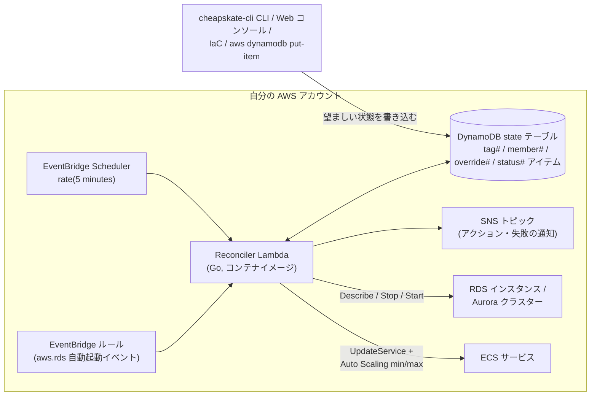

# cheapskate

RDS インスタンスと Aurora クラスターを **7日間の自動起動制限を超えて停止し続ける**こと、また RDS と **ECS サービス**(desiredCount 0 / 復元)の起動・停止をスケジュールすることを、DynamoDB に保持した望ましい状態とサーバーレスの reconcile ループで実現します。

- AWS は停止した RDS/Aurora を7日後に強制的に起動します。cheapskate は自動起動イベント(`RDS-EVENT-0153` / `RDS-EVENT-0154`)を検知し、即座に再停止します。
- 望ましい状態が `running` のリソースには一切手を出しません。
- cron ベースのスケジュール(例: 平日 09:00–20:00)も同じ reconcile ループで処理されるため、スケジュールと「停止を維持する」設定が競合することはありません。
- コントロールプレーンのコストは月1ドル未満(5分間隔で動く Lambda 1つ)です。

cheapskate は**ソースコードのみ**で配布されます。CloudFormation/Terraform テンプレートやモジュール、公開コンテナイメージはありません。イメージを自分でビルドして自分の ECR に push し、少数の AWS リソースを自前の IaC または手動で作成してください。必要な情報はすべて [usage/setup.md](usage/setup.md) にまとまっています。

## アーキテクチャ

Lambda は毎サイクル、望ましい状態(DynamoDB)と実際の状態(Describe API)を比較して収束させます。遷移中の状態(`starting`、`stopping` など)のリソースはスキップされ、次のサイクルで再度処理されます。RDS/ECS の API を呼び出すのは reconciler Lambda だけで、`cheapskate-cli` と Web コンソールは DynamoDB テーブルにしか触れません。

## ドキュメント

Usage — 自分の AWS アカウントへのホスティング:

- [usage/setup.md](usage/setup.md) — 作成するリソースの完全な仕様(設定値、IAM ポリシー、実行例つき)
- [usage/operations.md](usage/operations.md) — リソースの登録、`cheapskate-cli` CLI、Web コンソール、監視

Development — cheapskate 自体の開発:

- [development/build.md](development/build.md) — バイナリとコンテナイメージのビルド
- [development/test.md](development/test.md) — ユニット/統合テストと lint
- [development/run_local.md](development/run_local.md) — reconciler と Web コンソールのローカル実行

設計メモ: [DESIGN.md](../../DESIGN.md)、[DESIGN_v2.md](../../DESIGN_v2.md)、[DESIGN_v3.md](../../DESIGN_v3.md)(現行データモデル)、[consider.md](../../consider.md)。

## ライセンス

MIT
