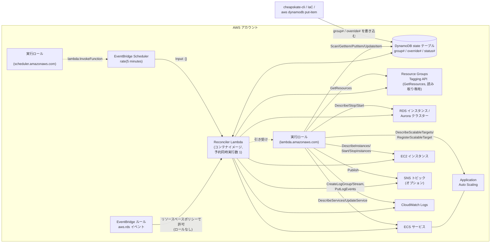
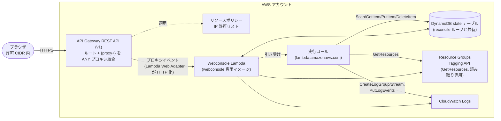

# AWS リソース構成図

作成する AWS リソースは 2 系統に分かれる。常時稼働する reconcile ループと、任意でデプロイする Web コンソールである。両者は DynamoDB state テーブルを共有する以外は独立しており、Web コンソールを構築しなくても reconcile ループは完結する。

## reconcile ループのリソース

reconcile ループを構成するリソースと、その間のデータの流れを図示すると、次の図のようになる。

図中の各リソースの役割と、必須かどうかを、以下にまとめる。

| リソース | 役割 | 必須 |
|---|---|---|
| DynamoDB state テーブル | 望ましい状態(`group#`/`override#`)と reconciler が書く実行結果(`status#`)を保持する唯一の永続ストア | 必須 |
| Reconciler Lambda(コンテナイメージ) | reconcile ループの実体。予約同時実行数 1 で多重実行を排除する | 必須 |
| Lambda 実行ロール | DynamoDB の読み書き、`tag:GetResources`、RDS/ECS/EC2 の Describe と制御系 API、Application Auto Scaling、(設定時)`sns:Publish`、CloudWatch Logs | 必須 |
| EventBridge Scheduler(`rate(5 minutes)`) | 定期 reconcile のトリガー。`{}` を渡す | 必須 |
| EventBridge ルール(`aws.rds` イベント) | RDS 自動起動イベント受信時に即時 reconcile をトリガーする。ターゲット呼び出しは Lambda のリソースベースポリシーで許可し、ルール側に IAM ロールを要しない | 必須 |
| Resource Groups Tagging API | セレクタからリソースを検出する唯一の経路 | 必須 |
| RDS / ECS / EC2(Application Auto Scaling 含む) | 起動・停止の対象リソース。管理しないリソースタイプの権限・接続は省略できる | 対象を使う場合のみ |
| SNS トピック | アクション実行・失敗時の通知先。未設定なら通知は no-op となる | オプション |
| CloudWatch ロググループ | 関数のログ出力先。事前作成と保持期間設定を推奨する | オプション |

## Web コンソールのリソース

Web コンソールを構成するリソースと、ブラウザからの到達経路を図示すると、次の図のようになる。

図中の各リソースの役割を、以下にまとめる。

| リソース | 役割 |
|---|---|
| API Gateway REST API(v1) | ブラウザからの唯一の入口。IP 制限に必要なリソースポリシーが HTTP API(v2)に無いため v1 を使う |
| リソースポリシー(IP 許可リスト) | 唯一のアクセス制御 |
| Webconsole Lambda | reconciler とは別のコンテナイメージから作る別関数 |
| Lambda 実行ロール | state テーブルへの `dynamodb:Scan/GetItem/PutItem/DeleteItem`、リソース種別ごとの `Describe*`、`tag:GetResources`、CloudWatch Logs。RDS/ECS/EC2 の制御系権限は持たない |
| DynamoDB state テーブル | reconcile ループと同一のテーブル。`group#`/`override#` を書き、`status#` は読むのと孤立レコードの削除のみ行う |
| Resource Groups Tagging API | グループページでの検出リソース一覧表示に使う |

デプロイは任意である。ローカルで動かす場合、この節の AWS リソースは不要となる。

## 2 系統の関係

共有リソースは DynamoDB state テーブルのみであり、互いの書き込み対象は重ならない。詳細は、[database.md](database.md) の読み書きマトリクスを参照。

Reconciler Lambda と Webconsole Lambda は別イメージ・別関数・別実行ロールであり、ビルドからデプロイまで独立して行える。Web コンソールを構築しない場合は `cheapskate-cli` が同じ役割を担う。アクセス経路が異なるだけで、書き込むアイテムの形は同じである。
