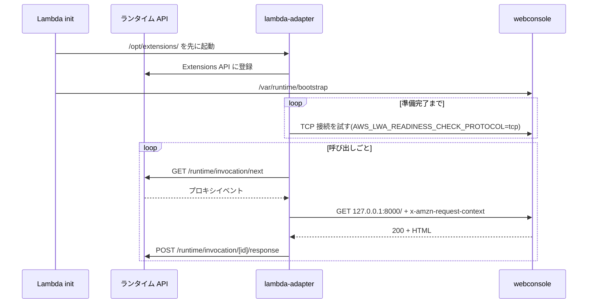
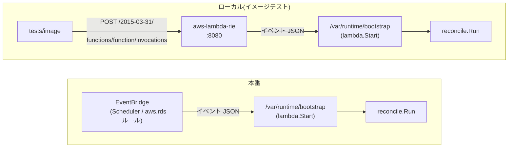
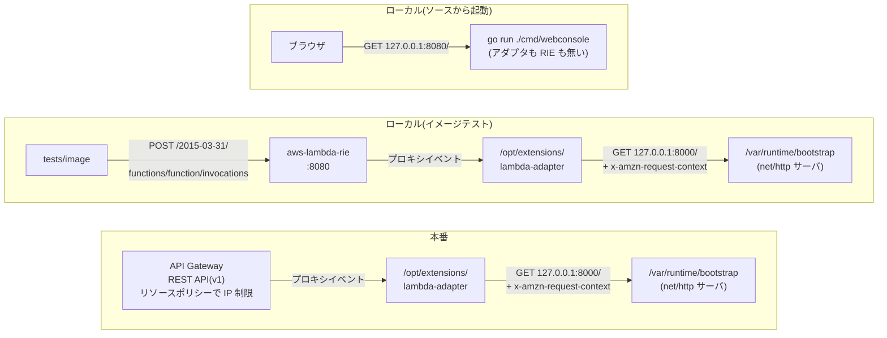

# Lambda 上での実行形態(RIE / LWA)

2 つの Lambda 関数は、いずれもコンテナイメージとしてデプロイする。このとき、Lambda ランタイムとの接続を、本体の外にある LWA または RIE が行う場合がある。両者の位置づけと出現範囲を、以下にまとめる。

| 名称 | 位置づけ | 出現範囲 |
|---|---|---|
| LWA(Lambda Web Adapter) | Web コンソールのイメージに同梱する外部拡張 | 本番とローカルの両方 |
| RIE(Runtime Interface Emulator) | ベースイメージに同梱されている Lambda 実行環境の代役 | ローカルのみ |

## 前提: Lambda ランタイム API と拡張

Lambda の実行環境は HTTP の API を 1 本立て、その所在を環境変数 `AWS_LAMBDA_RUNTIME_API` で渡す。関数側は次のループを回す実装(= ランタイム)を持つ。

1. `GET /2018-06-01/runtime/invocation/next` を長ポーリングして、次のイベントを受け取る
2. 処理する
3. `POST /2018-06-01/runtime/invocation/{requestId}/response`(失敗時は `.../error`)で結果を返す

ベースイメージの `public.ecr.aws/lambda/provided:al2023` はランタイムを持ち込む種類のものであり、起動時に `/var/runtime/bootstrap` を実行する。

もう 1 つの仕組みが外部拡張である。`/opt/extensions/` 以下の実行ファイルは、init が関数のランタイムより前に起動し、関数と並走する。

## 組み込み状況の一覧

コンポーネントごとの、ランタイム API との接続方式と、LWA および RIE の使用状況を、以下にまとめる。

| コンポーネント | ランタイム API との接続 | 本体の Lambda 依存 | LWA | RIE |
|---|---|---|---|---|
| reconciler | 本体にリンクした `aws-lambda-go` の `lambda.Start` | ハンドラ 1 つ | 入れない | ローカルのイメージテストのみ |
| webconsole | 同梱の LWA(`/opt/extensions/lambda-adapter`) | なし。素の `http.ListenAndServe` | 同梱する | ローカルのイメージテストのみ |
| cheapskate-cli | — | なし。Lambda では動かない | — | — |

reconciler に LWA が入らないのは、`aws-lambda-go` によりランタイム API を直接処理するためである。webconsole は Lambda ランタイムのライブラリを一切リンクしないため、`lambda.norpc` ビルドタグも付かない。

## Lambda Web Adapter(LWA)

[awslabs/aws-lambda-web-adapter](https://github.com/awslabs/aws-lambda-web-adapter)。HTTP サーバを Lambda 関数として動かすための外部拡張である。

### 外形的な振る舞い

アダプタは拡張として先に起動し、アプリの準備完了を待ってから、ランタイム API のループを代わりに回す。

アダプタの入出力の仕様を、以下に示す。

| 項目 | 内容 |
|---|---|
| 受け取るイベント形式 | API Gateway REST API v1 / HTTP API v2 / Function URL / ALB のいずれでもよい。アダプタが吸収する |
| 元イベントの `requestContext` | JSON 文字列として `x-amzn-request-context` ヘッダに載る |
| Lambda のコンテキスト | `x-amzn-lambda-context` ヘッダに載る |
| アプリの応答 | ステータス・ヘッダ・ボディがプロキシレスポンスの JSON に戻され、ランタイム API へ返る |

アプリから見えるのは、ループバックから来た HTTP リクエスト 1 本だけである。したがって `RemoteAddr` は常にアダプタのループバックアドレスであり、接続元の手がかりにならない。

### 詐称できないヘッダ

`x-amzn-request-context` はアダプタが毎回書き直す。クライアントが同名のヘッダを送っても、それはイベントの `headers` に入るだけで、アダプタがアプリへ渡す段で元イベント由来の値に置き換わる。

Web コンソールは接続元 IP をここから取る。`identity.sourceIp`(REST API v1)または `http.sourceIp`(HTTP API v2 / Function URL)は、API Gateway への TCP 接続元そのものであり、リソースポリシーの `aws:SourceIp` が許可判定に使う値と同一である。アクセス制御が IP 許可リストだけである以上、ログに残すべきなのは実際に許可判定された IP であり、クライアントの自己申告ではない。`X-Forwarded-For` を見ないのも同じ理由による。API Gateway は観測した IP を末尾に追記するため、先頭はクライアントが自由に書ける。

この差し替えが実際に起きることは、イメージを通してしか確認できない。単体テストが確かめられるのはヘッダがあればそこから読むところまでであり、アダプタがそのヘッダを立て直すことはアダプタの振る舞いだからである。

### webconsole への組み込み

`Dockerfile` の `webconsole` ステージが行うこと:

| 内容 | 理由 |
|---|---|
| アダプタの実行ファイルを `/opt/extensions/` へコピーする。バージョンは正確に固定する | go.mod の外にある唯一の実行時依存であり、更新が他の経路で検知されないためである |
| `ENV PORT=8000 AWS_LWA_PORT=8000` | アダプタの接続先とサーバの待ち受けを、イメージ自身が持つ契約として揃える。8080 でないのは、ローカルで RIE を挟むときにそちらが 8080 を使うためである |
| `ENV AWS_LWA_READINESS_CHECK_PROTOCOL=tcp` | 準備完了の判定を TCP 接続の可否にする。既定の HTTP チェックはコールドスタートのたびに `GET /` を発行し、DynamoDB を読ませるためである |

本体側で LWA を前提にしているのは 2 か所であり、どちらも無ければローカル実行の振る舞いに落ちる。

| 場所 | 前提 | 無いとき |
|---|---|---|
| `cmd/webconsole/main.go` | `PORT` があればそのポートで待ち受ける | `-addr`(既定 `127.0.0.1:8080`) |
| `internal/ui/webconsole` の `clientIP` | `x-amzn-request-context` から接続元 IP を取る | `RemoteAddr`(ポートを落としたもの) |

## Runtime Interface Emulator(RIE)

ベースイメージに `/usr/local/bin/aws-lambda-rie` として同梱されている Lambda 実行環境の代役である。本番の経路には出現しない。

### 外形的な振る舞い

起動すると 8080 を listen し、`AWS_LAMBDA_RUNTIME_API` を自分に向けたうえで、引数に渡されたコマンドを子プロセスとして起動する。`POST http://<host>:8080/2015-03-31/functions/function/invocations` にペイロードを送ると、それを 1 回の呼び出しとしてランタイム API に流し、ハンドラの応答をそのまま HTTP 応答の本文として返す。関数名は `function` 固定である。

実際の Lambda と同じく `/opt/extensions` 以下の拡張を起動する。LWA の経路をローカルで通せるのはこの性質による。関数のログは stderr からコンテナのログに出る。

### 本物との差

RIE が実際の Lambda 実行環境と異なる点を、以下に示す。

| 差 | 内容 |
|---|---|
| ハンドラが error を返しても HTTP は 200 になる | 失敗は本文の `errorMessage` / `errorType` に出る。ステータスコードで分かるのは呼び出せたかまでである |
| ポートが開いた時点で呼び出しを受けられるとは限らない | 最初の 1 回が通るまで待つ必要がある |
| 持たない機能がある | 認証、課金、実行タイムアウト、同時実行制御、CloudWatch Logs への配信 |

### 組み込み状況

イメージには何も足さない。ベースイメージに元から入っているものを、ローカルで使うときだけ呼び出す。本番のイメージはエントリポイントを上書きしない。

ローカルで挟むときだけ、コンテナの entrypoint を `/usr/local/bin/aws-lambda-rie`、cmd を `/var/runtime/bootstrap` に差し替える。これを要するのは対象がビルド済みイメージのときだけであり、ソースから直接起動する経路には出現しない。

## 経路の比較

reconciler — LWA は関与しない。ローカルとの差は、ランタイム API の提供元が Lambda 実行環境か RIE かだけである。

webconsole — 本番との差も RIE が 1 段挟まることだけであり、アダプタから先は同一である。

RIE と LWA が経路に入るのはイメージテストだけである。単体テストと統合テストはハンドラやパッケージを直接呼ぶため、どちらも通らない。
