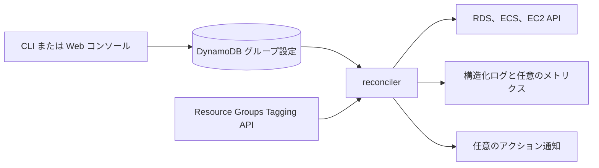

# 全体構成

cheapskate は、グループごとに望ましい状態を求め、固定タグで所属するリソースを特定し、現在の状態との差がある安定したリソースだけを変更する収束型コントローラーである。

次の図に、主要コンポーネントと外部サービスの関係を示す。

reconciler は、グループ設定の Query と `GetResources` の全ページを完了してから、リソースを Describe する。どちらかの一括読み込みに失敗した場合は、リソースを変更せずにサイクルを中断する。

グループまたはリソース単位のエラーは他のリソースへ波及させず、サイクルの集計と構造化ログへ出力する。DynamoDB には実行履歴を保存しない。

複数の invocation は同時に実行できる。操作回数は at-least-once であり、古い設定を読んだ invocation が終了した後の成功サイクルで、最新設定へ収束する。
