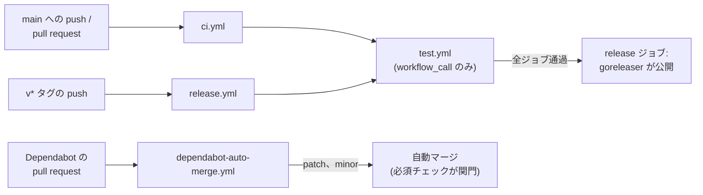

# GitHub Actions

CI、リリース、依存の更新は、いずれも `.github/` から GitHub Actions 上で実行する。ここで扱うのはワークフローそのものである。各ワークフローが何であり、互いにどう組み合わさり、変更したときに何が壊れるかを記述する。リリースの手順、リリースが生成するもの、依存の更新設定の根拠は [release.md](release.md) にある。

## ワークフロー

| パス | トリガ | 役割 |
|---|---|---|
| `workflows/ci.yml` | `main` への push、pull request | `test.yml` を呼ぶ |
| `workflows/test.yml` | `ci.yml` と `release.yml` から呼ばれる | lint、ユニット、統合、イメージテスト、goreleaser の check とスナップショットビルド |
| `workflows/release.yml` | `v*` タグの push | `test.yml` を呼び、その後 goreleaser が GitHub リリースとイメージを公開する |
| `workflows/dependabot-auto-merge.yml` | pull request | Dependabot の patch/minor 更新を自動マージに載せる |
| `dependabot.yml` | 週次 | Go モジュール、Actions、Docker ベースイメージ。グループ化し、7 日の cooldown で抑える |

`test.yml` は自身のトリガを持たない(`workflow_call`)。したがってリリース時には、pull request と同一の検査がタグ付けされたコミットに対して走る。リリースジョブは `needs: test` を宣言しており、いずれかが失敗した場合、そのタグにリリースは作られず、GHCR へも何も push されない。

各ジョブは `ubuntu-latest` 上で動き、Go のバージョンは `go.mod` から取る。統合テストとイメージテストに認証情報は要らない。エミュレータも Runtime Interface Emulator も、ランナーの docker デーモンで動く([test.md](test.md))。

## 構成



## チェック名

`ci.yml` は再利用可能ワークフロー経由で各ジョブに到達するため、チェック名は両方の階層を含む形になる。`test / lint`、`test / unit`、`test / integration`、`test / image`、`test / goreleaser` である。ブランチ保護はこの名前で必須チェックを選ぶ。自動マージの経路に関門があるかどうかも、これらが選ばれているかに依存する([release.md](release.md))。

## トークンの権限

各ワークフローは先頭で `permissions: contents: read` を宣言し、必要なジョブでのみ引き上げる。書き込み権限を持つのは必要な間だけである。リリースジョブは `contents: write` と `packages: write`、自動マージのジョブは `contents: write` と `pull-requests: write` を持つ。

Dependabot によって起動された実行だけは既定が異なる。ワークフローが何を要求していても、`GITHUB_TOKEN` は読み取り専用となり、Actions のシークレットにも触れられない。マージに必要な水準へ引き上げているのは、ジョブ単位の `permissions` である。

## action の SHA 固定

action はすべてタグではなく完全なコミット SHA で固定する。対応するバージョンは行末のコメントに残す。

```yaml
- uses: actions/checkout@3d3c42e5aac5ba805825da76410c181273ba90b1 # v7.0.1
```

タグは動かせる参照である。action のリポジトリの管理権限を持つ者は `v7` を別のコードへ差し替えられ、それを参照する全てのワークフローは、こちらに何の変更も入らないまま次回の実行からその内容を取り込む。SHA は差し替えられない。とりわけ効くのは、`contents: write` と `packages: write` を持つリリースのワークフローと、書き込み権限を持ち人を介さずマージする自動マージのワークフローである。

行末のコメントは飾りではない。Dependabot はこれを読み、新しいバージョンが出れば SHA を更新し、コメントも書き換える。したがって固定したまま古びることはない。例外は `uses: ./.github/workflows/test.yml` で、ローカルの再利用可能ワークフローは実行中のコミットで解決されるため、固定すべきものがない。

## 静かに壊れる変更

| 変更 | 起きること |
|---|---|
| action の参照を SHA からタグに戻す | 参照が再び可変になり、このリポジトリに何も入らないまま別のコードに差し替えられる |
| `test.yml` のジョブ名を変える | ブランチ保護は必須チェックを名前で選ぶため、改名したジョブは必須でなくなり、失敗として現れないままマージの関門が開く |
| `test.yml` にジョブを足す | `release.yml` が同じワークフローを呼ぶため、リリースも同じ時間を払う |
| `dependabot.yml` から `cooldown` を外す | 公開直後のバージョンが対象となり、レビューを経ないまま自動マージ経路で `main` に入る |

## このディレクトリの外にあるもの

リリース経路の残りは `.github/` の外にある。リポジトリルートの `.goreleaser.yaml` がリリースの生成物を定義し、`build/Dockerfile.reconciler` と `build/Dockerfile.webconsole` が公開されるイメージを組み立てる。
