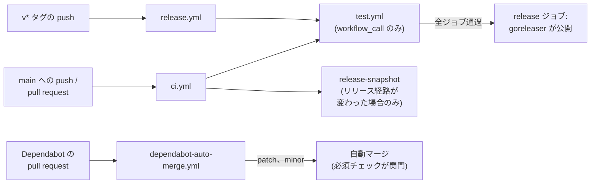

# GitHub Actions

CI、リリース、依存の更新は、いずれも `.github/` 配下の定義により GitHub Actions 上で実行される。本ドキュメントは、各ワークフローの役割、相互の呼び出し関係、および変更時に生じる影響を記述する。

## ワークフロー

`.github/` に置く定義ファイルと、その役割を、以下にまとめる。

| パス | トリガ | 役割 |
|---|---|---|
| `workflows/ci.yml` | `main` への push、pull request | `test.yml` を呼ぶ。リリース経路が変わった場合はスナップショットも行う |
| `workflows/test.yml` | `ci.yml` と `release.yml` から呼ばれる | lint、ユニット、統合、イメージテスト、`goreleaser check` |
| `workflows/release.yml` | `v*` タグの push | `test.yml` を呼び、その後 goreleaser が GitHub リリースとイメージを公開する |
| `workflows/dependabot-auto-merge.yml` | pull request | Dependabot の patch/minor 更新を自動マージに載せる |
| `dependabot.yml` | 週次 | Go モジュール、Actions、Docker ベースイメージ。グループ化し、7 日の cooldown で抑える |

`test.yml` は自身のトリガを持たない(`workflow_call`)。したがってリリース時には、pull request と同一の検査がタグ付けされたコミットに対して走る。リリースジョブは `needs: test` を宣言しており、いずれかが失敗した場合、そのタグにリリースは作られず、GHCR へも何も push されない。

各ジョブは `ubuntu-latest` 上で動作し、Go のバージョンは `go.mod` から取る。統合テストとイメージテストに認証情報は要らない。エミュレータも Runtime Interface Emulator も、ランナーの docker デーモンで動作する。

## 構成

トリガから成果物の公開までの呼び出し関係を図示すると、次の図のようになる。



## リリースのスナップショット

`goreleaser check` は設定を検証するがビルドを行わない。したがって `build/Dockerfile.*` の誤りは検出できない。それを検出するのはスナップショットのみである。スナップショットは全ターゲットをクロスコンパイルし、両方のイメージを組み立て、何も push しない。`--skip=publish` ではなく `--snapshot` である必要がある。dockers_v2 はビルドと push が一体であり、publish を飛ばすとイメージのビルドごと飛ぶためである。

同時に、これは CI で最も所要時間が長い。他の全ジョブの合計が約 3 分であるのに対し、単独で約 6 分を要する。そして、これを破壊しうるのはリリース経路の変更だけである。したがってビルドが走るのは、`.goreleaser.yaml`、`build/`、ルートの `Dockerfile`、モジュールファイルのいずれかが変わった場合に限る。ジョブ自体は常に実行する。`on.paths` でジョブごと除外すると、報告されない必須チェックが生まれ、pull request がそれを永久に待つことになるためである。代わりに、ジョブは常に結果を報告し、重いステップだけを飛ばす。

この構成で残る隙は、linux ではコンパイルできるが CLI のリリース対象プラットフォームでは通らない Go の変更である。`make lint` が CLI を darwin と windows 向けにクロスコンパイルすることで、これを pull request ごとに塞ぐ。ビルドキャッシュが温まっていれば数秒で完了する。

## チェック名

`ci.yml` は大半のジョブに再利用可能ワークフロー経由で到達するため、それらのチェック名は両方の階層を含む形になる。すなわち `test / lint`、`test / unit`、`test / integration`、`test / image`、`test / goreleaser` である。`release-snapshot` は `ci.yml` 自身のジョブであり、その名前のまま現れる。

ブランチ保護はこれらの名前で必須チェックを選ぶ。Dependabot の自動マージが関門を経るかどうかも、これらが選ばれているかに依存する。自動マージ側から見た必要条件は、[release.md](release.md) の自動マージを参照。

## トークンの権限

各ワークフローは先頭で `permissions: contents: read` を宣言し、必要なジョブでのみ引き上げる。書き込み権限を持つのは必要な間だけである。リリースジョブは `contents: write` と `packages: write`、自動マージのジョブは `contents: write` と `pull-requests: write` を持つ。

Dependabot によって起動された実行だけは既定が異なる。ワークフローが何を要求していても、`GITHUB_TOKEN` は読み取り専用となり、Actions のシークレットにも触れられない。マージに必要な水準へ引き上げているのは、ジョブ単位の `permissions` である。

## action の SHA 固定

action はすべてタグではなく完全なコミット SHA で固定する。対応するバージョンは行末のコメントに残す。記述の形式は次のとおりである。

```yaml
- uses: actions/checkout@3d3c42e5aac5ba805825da76410c181273ba90b1 # v7.0.1
```

タグは可変の参照である。action のリポジトリの管理権限を持つ者は `v7` を別のコードへ差し替えられ、それを参照する全てのワークフローは、こちらに何の変更も入らないまま次回の実行からその内容を取り込む。SHA は差し替えられない。この差が特に効くのは、`contents: write` と `packages: write` を持つリリースのワークフローと、書き込み権限を持ち人を介さずマージする自動マージのワークフローである。

行末のコメントは Dependabot の入力である。Dependabot はこれを読み、新しいバージョンが出れば SHA を更新し、コメントも書き換える。したがって固定したまま古びることはない。例外は `uses: ./.github/workflows/test.yml` であり、ローカルの再利用可能ワークフローは実行中のコミットで解決されるため、固定すべき対象がない。

## 検知されにくい変更の影響

ワークフローへの変更のうち、実行が成功したままで効果だけが失われるものを、以下にまとめる。

| 変更 | 生じること |
|---|---|
| action の参照を SHA からタグに戻す | 参照が再び可変になり、このリポジトリに何も入らないまま別のコードに差し替えられる |
| `test.yml` のジョブ名を変える | ブランチ保護は必須チェックを名前で選ぶため、改名したジョブは必須でなくなり、失敗として現れないままマージの関門が開く |
| `test.yml` にジョブを足す | `release.yml` が同じワークフローを呼ぶため、リリースも同じ時間を要する |
| `dependabot.yml` から `cooldown` を外す | 公開直後のバージョンが対象となり、レビューを経ないまま自動マージ経路で `main` に入る |
| `release-snapshot` を内部の条件分岐ではなく `on.paths` で絞る | 条件に合わない pull request でチェックが報告されなくなり、それを必須とした pull request は到達しない結果を待ち続ける |

## `.github/` の外にある構成要素

リリース経路の残りは `.github/` の外にある。リポジトリルートの `.goreleaser.yaml` がリリースの生成物を定義し、`build/Dockerfile.reconciler` と `build/Dockerfile.webconsole` が公開されるイメージを組み立てる。
