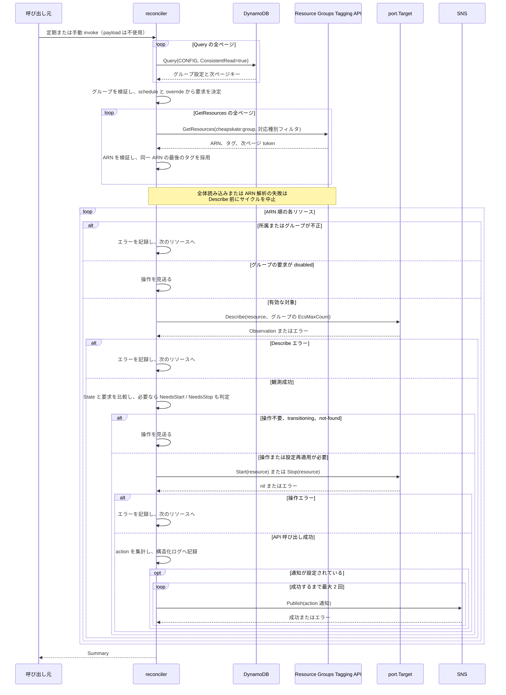
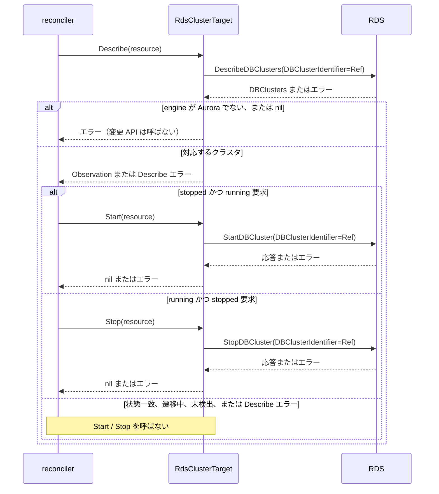
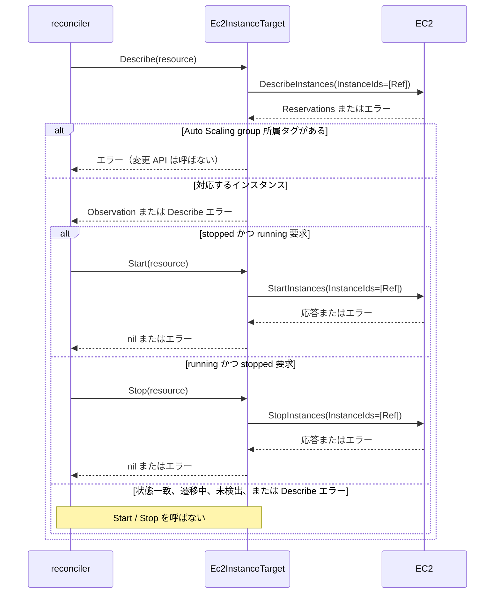
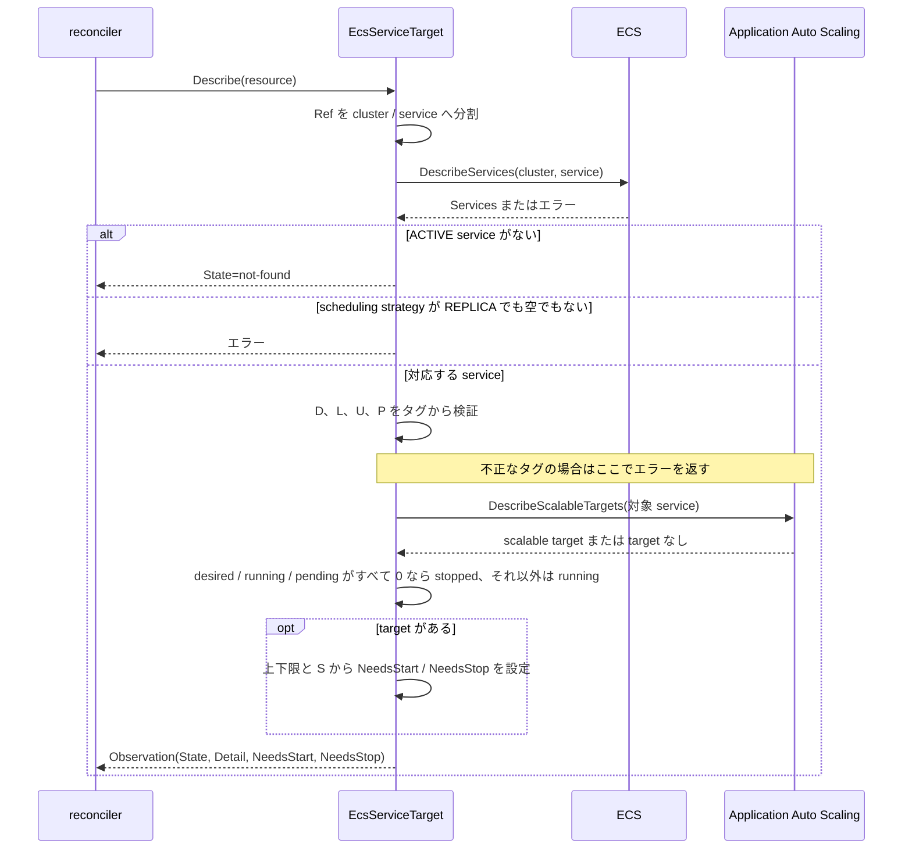
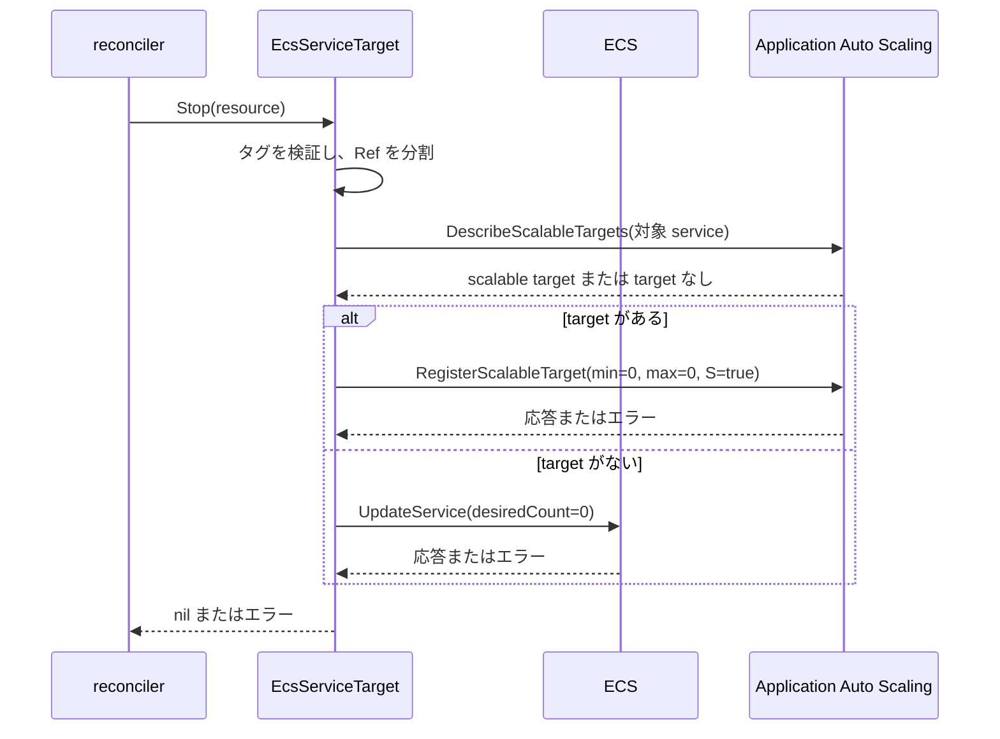
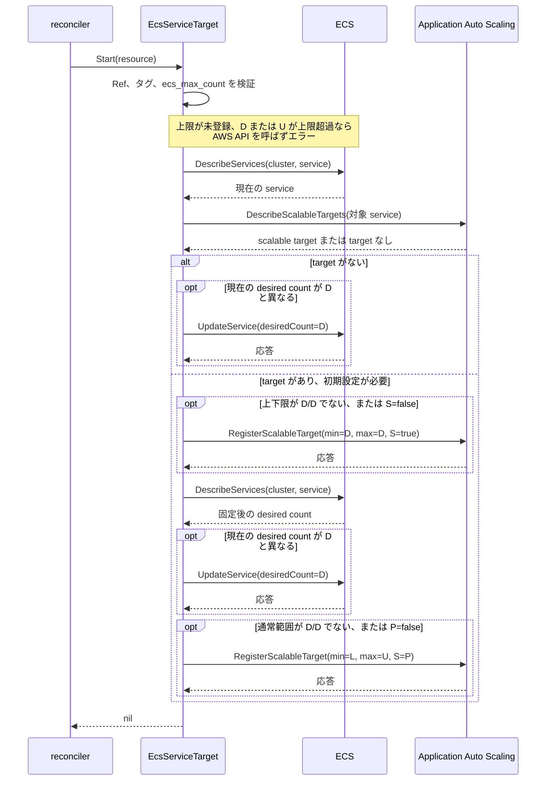
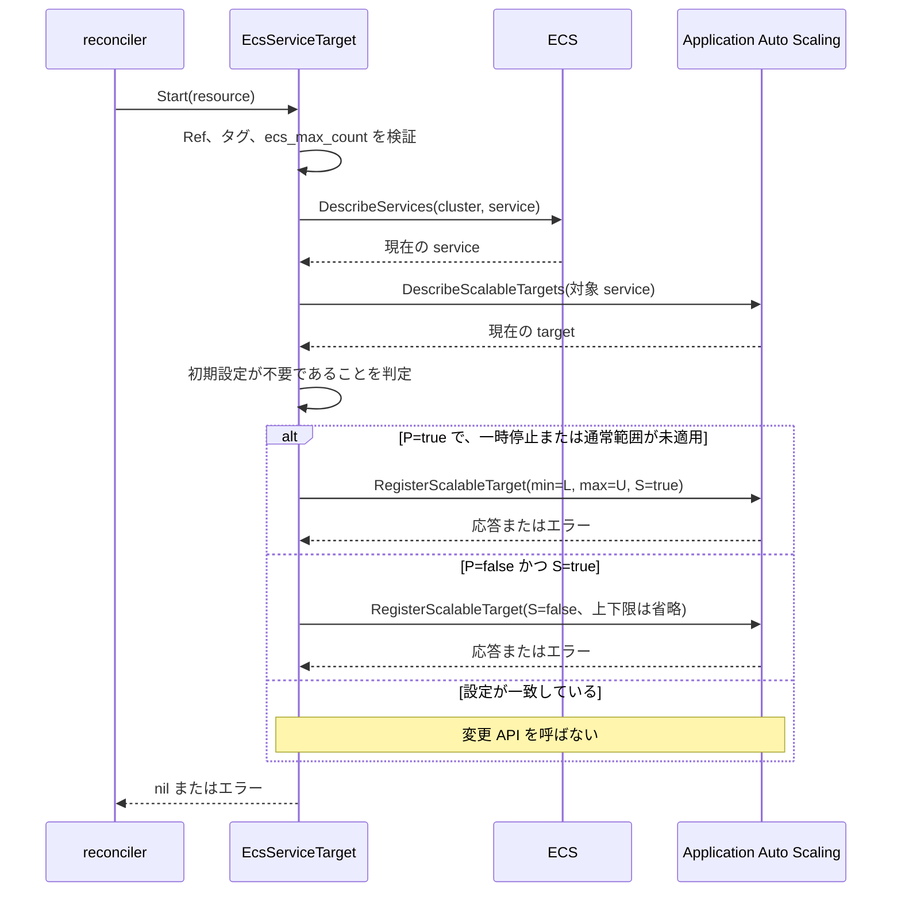
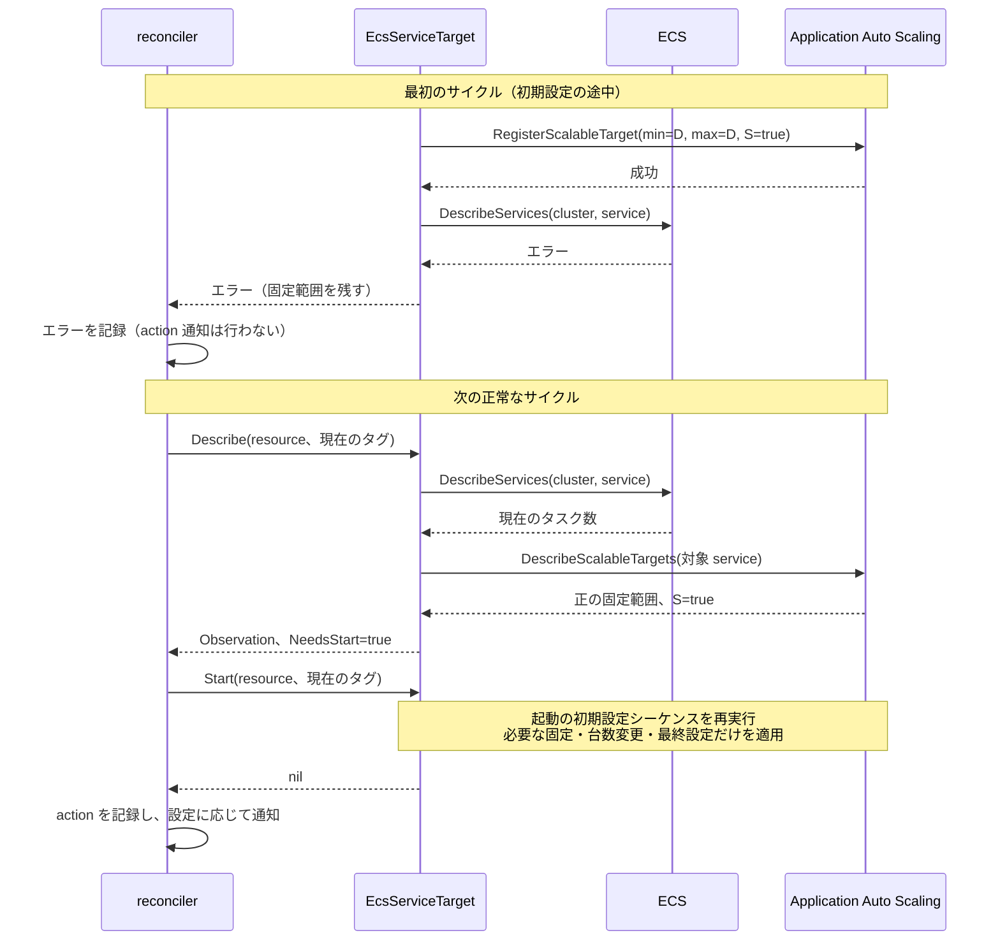

# リソース操作のシーケンス

本ドキュメントは、reconciler と各リソース adapter の呼び出し順、AWS API の分岐、および再適用の条件を示す。コードの読解に必要な入力値と観測結果を記載する。図では AWS SDK 内部の retry を省略する。

## 共通の reconcile サイクル

1 サイクルは全グループと探索結果を取得した後、リソースを ARN 順に処理する。グループの要求が disabled の場合、adapter の Describe も呼ばない。設定読み込みから操作結果の処理までのシーケンスを、次の図に示す。

通知失敗はログへ記録し、API 操作の成功を取り消さない。Start または Stop の成功はリソースの遷移完了を意味しない。後続サイクルで再観測する。DynamoDB への履歴、checkpoint、および AWS 設定の保存は行わない。

サイクル全体の失敗境界と同時実行の扱いは、[Reconcile の境界](reconcile.md)を参照。実装は、[reconciler](../../../internal/app/reconcile/reconcile.go)と[リソース探索](../../../internal/aws/tagging/tagging.go)を参照。

## RDS DB インスタンス

DBClusterIdentifier が非空、または engine が custom- で始まるインスタンスを拒否する。Describe から変更 API までのシーケンスを、次の図に示す。

DBInstanceStatus の available を running、stopped を stopped、その他を transitioning へ対応づける。DBInstanceNotFoundFault、空の応答、または状態を取得できるインスタンスがない場合は not-found とする。DBInstanceStatus が nil の要素は状態判定に使用しない。

実装は、[RDS adapter](../../../internal/aws/compute/rds.go)を参照。

## Aurora DB クラスタ

engine が aurora で始まるクラスタだけを扱う。クラスタのシーケンスを、次の図に示す。

Status の available を running、stopped を stopped、その他を transitioning へ対応づける。DBClusterNotFoundFault、空の応答、または状態を取得できるクラスタがない場合は not-found とする。Status が nil の要素は状態判定に使用しない。クラスタ member の DB インスタンスへの変更 API は呼ばない。

実装は、[RDS adapter](../../../internal/aws/compute/rds.go)を参照。

## EC2 インスタンス

DescribeInstances のタグに aws:autoscaling:groupName がある場合、インスタンスを拒否する。インスタンスのシーケンスを、次の図に示す。

State.Name の running と stopped を同名の観測状態へ対応づける。terminated と InvalidInstanceID.NotFound は not-found、それ以外の状態は transitioning とする。空の応答、または State が nil のインスタンスしかない場合は not-found とする。

実装は、[EC2 adapter](../../../internal/aws/compute/ec2.go)を参照。

## ECS service

ECS は現在のタスク数に加えて scalable target の設定を観測する。設定タグは探索時の snapshot を使用し、Start と Stop でも検証する。以下のシーケンスで用いる記号を、次の表に示す。

| 記号 | 意味 |
| --- | --- |
| D | desired-count タグの既定値適用後の起動台数 |
| L / U | scaling-min / scaling-max タグの既定値適用後の通常の上下限 |
| P | scheduled-scaling-paused タグの要求。未設定は false |
| S | AWS の ScheduledScalingSuspended。未取得または nil は false |

scalable target の識別子は ServiceNamespace=ecs、ResourceId=service/{cluster}/{service}、ScalableDimension=ecs:service:DesiredCount である。すべての RegisterScalableTarget は ScheduledScalingSuspended だけを指定し、DynamicScalingInSuspended と DynamicScalingOutSuspended は省略する。scheduled action の定義は読み書きしない。

### 状態観測

タスク状態と設定の再適用要求を返すシーケンスを、次の図に示す。

Ref の分割または DescribeServices が失敗した場合もエラーを返す。Detail にはタスク数を含め、target がある場合は上下限と実際の S も含める。target がない場合、NeedsStart と NeedsStop は設定しない。

再適用判定を、以下に示す。両方のフラグが true になる場合も、reconciler はグループの要求に対応する判定だけを使用する。

| 判定 | 条件 |
| --- | --- |
| NeedsStop | 上下限が 0/0 でない、または S=false |
| NeedsStart | タスクがすべて 0、上下限が 0/0、または起動途中の固定範囲 |
| NeedsStart | S と P が異なる |
| NeedsStart | P=true で、上下限が L/U と異なる |

起動途中の固定範囲は S=true、min=max が正の値、かつ L/U と異なる範囲である。固定値が現在の D と同じであることは条件にしない。P=false の通常稼働中は、Scheduled Scaling による上下限変更を再適用の理由にしない。

### 停止

Stop はタグを検証して target を再取得する。停止シーケンスを、次の図に示す。

P の値によらず S=true を適用し、P 自体は変更しない。ecs_max_count による停止の拒否は行わない。target がある場合は UpdateService と rollback を追加しない。

### 起動の初期設定

Start は、Ref、タグ、および ecs_max_count を検証した後、service と target を再取得する。停止状態、上下限 0/0、または起動途中の固定範囲から初期設定を行うシーケンスを、次の図に示す。

この図は成功経路であり、各 API が失敗した時点で後続の呼び出しを中止してエラーを返す。service が見つからない場合や REPLICA 以外の場合もエラーとなる。固定後の再観測は、RegisterScalableTarget が capacity を上下限内へ調整する動作を考慮したものである。

P=false の解除は最後の RegisterScalableTarget だけで行う。P=true かつ L=U=D の場合は、最初の固定で通常設定も成立するため最後の RegisterScalableTarget を省略する。稼働中で初期設定が不要な場合は、次の設定再適用シーケンスを使用する。

### 稼働中の設定再適用

起動の初期設定が不要な service への Start は、一時停止要求だけを再適用する。シーケンスを、次の図に示す。

UpdateService は呼ばず、起動台数へ戻さない。フラグだけの RegisterScalableTarget でも、現在の capacity が上下限の範囲外なら AWS が調整しうる。上下限が 0/0 または起動途中の固定範囲の場合は、このシーケンスではなく初期設定を行う。

### 部分失敗と後続サイクル

通常のタグ範囲と異なる起動台数への固定後に、ECS の再観測が失敗した場合の復旧シーケンスを、次の図に示す。

一時停止要求が true であることだけでは初期設定途中と判定しない。主な失敗と再適用の関係を、以下に示す。

| 残った状態 | 後続サイクル |
| --- | --- |
| 停止設定が未適用 | 上下限または S の差から停止を再適用する |
| 起動途中の固定範囲 | 現在の D、L/U、P で初期設定を再開する |
| L=U=D で S だけが要求と異なる | フラグの差を再適用する |
| 最後の更新の応答喪失後、P=true で通常設定が一致 | 追加操作を行わない |
| 最後の更新の応答喪失後、P=false で Scheduled Scaling が上下限を変更 | 変更された範囲を維持する |

古い snapshot に基づく invocation は古い要求を適用しうる。最新の要求への収束は、その invocation の終了後に成功する後続サイクルで行う。disabled、管理終了、および cheapskate 自体の実行停止では、適用済みの AWS フラグと上下限を復元しない。

実装は、[ECS adapter](../../../internal/aws/compute/ecs.go)を参照。部分失敗と設定維持の検証は、[ECS の既存テスト](../../../internal/aws/compute/ecs_test.go)と[Scheduled Scaling のテスト](../../../internal/aws/compute/ecs_scheduled_scaling_test.go)を参照。
