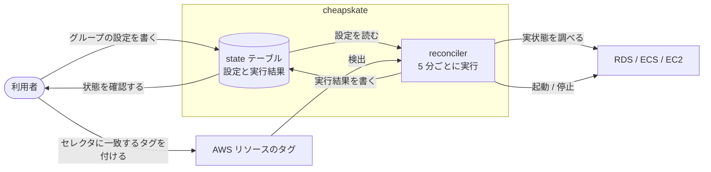

# 用語と全体像

cheapskate は、AWS リソースのあるべき状態を登録しておき、実際の状態をそれに合わせ続けるツールである。このページは、他の利用者向けページで使う用語を定義する。

## 全体の流れ

- 設定変更もタグの付け外しも、反映は次の reconcile サイクルからとなる
- 望ましい状態と実状態が一致していれば、何も行わない

## 用語

| 用語 | 意味 |
| --- | --- |
| ターゲットグループ(グループ) | 設定の単位。望ましい状態の決め方と、対象リソースを選ぶセレクタを持つ |
| セレクタ | 管理対象を選ぶ条件。AWS タグのキー/値と、対象リソースタイプの組 |
| 検出 | セレクタに一致するリソースを AWS のタグから探すこと。リソースの個別登録は存在しない |
| 望ましい状態 | そのグループのリソースがあるべき状態。`running` または `stopped` |
| reconcile(収束) | 望ましい状態と実状態を比較し、異なれば起動・停止して合わせること |
| reconcile サイクル | 全グループについて reconcile を 1 巡すること。既定は 5 分間隔 |
| reconciler | reconcile サイクルを実行する Lambda 関数。AWS リソースを起動・停止する唯一のコンポーネント |
| 固定(pin) | スケジュールを使わず、望ましい状態を 1 つに固定すること |
| 無効化(disable) | グループを reconcile の対象から外すこと |
| override | 期限付きで望ましい状態を上書きする指定 |
| state テーブル | 設定と実行結果を保持する DynamoDB テーブル |
| status レコード | reconciler が書く実行結果。直近のアクション、直近のエラー、継続中の遷移を持つ |
| 遷移中 | 起動・停止の途中にある状態。reconciler は操作せず、次のサイクルまで待つ |
| 孤立レコード | 対応するグループやリソースが存在しなくなった state テーブルのレコード |

レコードの具体的な属性と操作方法は [operations.md](operations.md)、リソースに付けるタグは [resource_tag.md](resource_tag.md)。
