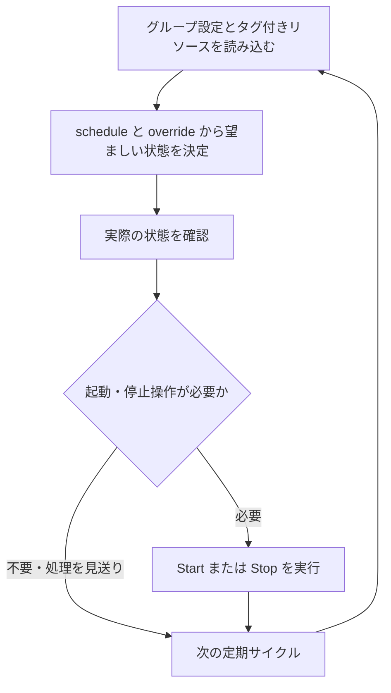

# 基本概念

cheapskate は、タグ付き AWS リソースを、所属グループで決まる状態へ定期的に収束させる。設定は schedule、override、またはその両方で構成する。

## グループと所属

リソースは `cheapskate:group` タグの値と同名のグループに所属する。空のタグ値、不正なグループ名、および未設定のグループ名はリソース単位のエラーになる。グループ名は 1～64 文字であり、ASCII の英字、数字、ピリオド、アンダースコア、およびハイフンを使用できる。先頭文字は ASCII の英字または数字である。

reconciler は、全グループと全タグ付きリソースを読み込んでから、Describe、Start、または Stop を呼び出す。全体の読み込みに失敗した場合はサイクルを中断する。不正なグループまたはリソースは個別に処理し、他のリソースは継続する。

## schedule と override

schedule は、グループの通常の起動・停止時刻を cron で定める設定である。

override は、グループを起動状態に保つ running、停止状態に保つ stopped、または自動制御を無効にする disabled の指定である。有効期限を設定することも、無期限にすることもできる。

両方がある場合、有効な override が schedule より優先される。override は schedule を書き換えず、解除または失効すると、その時点の schedule に従う状態へ戻る。

## 望ましい状態の決定

有効な override を次の優先順で処理する。

1. `disabled` の場合、グループを reconcile 対象外にする。
2. `running` の場合、起動状態を選択する。
3. `stopped` の場合、停止状態を選択する。
4. 有効な override がない場合、直近の start cron と stop cron のうち新しい側を選択する。同時刻の場合は停止状態を選択する。

`override_expires_at <= now` の override は失効済みである。DynamoDB に属性が残っていても、schedule が自動的に有効になる。

schedule は、`DEFAULT_TIMEZONE` で解釈する 5 フィールド cron 2 個の組である。両方が存在し、過去と未来の発火時刻を取得できなければならない。グループは schedule または override の少なくとも一方を持つ。期限付き override には schedule も必要である。

### 稼働時間を延長する例

dev グループに所属する EC2 instance を、平日の 09:00 から 18:00 まで起動状態に保つ例を示す。時刻は DEFAULT_TIMEZONE を Asia/Tokyo に設定した場合の日本時間とする。この場合の schedule は次のとおりである。

```text
start cron: 0 9 * * 1-5
stop cron: 0 18 * * 1-5
```

月曜日だけ 20:00 まで稼働時間を延長するため、17:00 に同日 20:00 まで有効な running override を設定した場合の望ましい状態を、以下に示す。

| 時刻 | schedule による状態 | override | 望ましい状態 |
| --- | --- | --- | --- |
| 月曜日 09:00 | 起動 | なし | 起動 |
| 月曜日 17:00 | 起動 | running が有効 | 起動 |
| 月曜日 18:00 | 停止 | running が有効 | 起動 |
| 月曜日 20:00 | 停止 | 失効済み | 停止 |
| 火曜日 09:00 | 起動 | 失効済み | 起動 |

20:00 になると、直近の stop cron の発火時刻である 18:00 に基づいて停止状態を選択する。実際の停止操作は、失効を読み取った reconciliation サイクルで行う。

## 収束と同時実行

reconciliation ループは、設定から決めた望ましい状態と実際の状態を定期的に比較し、必要な起動・停止操作を繰り返す処理である。reconciler が各サイクルを実行する。自動制御が有効な各リソースに対する処理の概要を、次の図に示す。



観測した起動・停止状態が望ましい状態と異なる場合にアクションを実行する。RDS と EC2 で遷移中と判定したリソース、および見つからないリソースは、後続サイクルまで処理を見送る。

例えば、上記の dev グループで月曜日の 10:00 に EC2 instance を手動停止すると、後続サイクルで停止状態を確認した reconciler が再び起動する。

自動制御を一時的に止める場合は disabled override を設定する。disabled 自体はリソースを起動・停止しない。

ECS は desired count、running count、pending count がすべて 0 の場合だけ停止状態とし、それ以外は起動状態とする。タスク数の不一致によって停止操作を見送ることはない。起動・停止状態が一致していても、scalable target の min/max がその状態の設定値と異なる場合は Start または Stop を再適用する。ECS の判定と復元の詳細は、[リソースタグ](resource_tag.md) を参照。

invocation は同時に実行される場合がある。Start または Stop を複数回配送したり、異なる設定を読んだ invocation が一時的に反対のアクションを実行したりする可能性がある。古い invocation の終了後に成功したサイクルが、最新設定へ収束させる。

## 対応リソース

- DB cluster の member ではなく、`custom-*` engine を使用しない RDS DB instance
- engine が `aurora` から始まる RDS DB cluster
- `REPLICA` scheduling strategy の ECS service
- EC2 instance

ECS の復元設定は、[リソースタグ](resource_tag.md)を参照すること。
