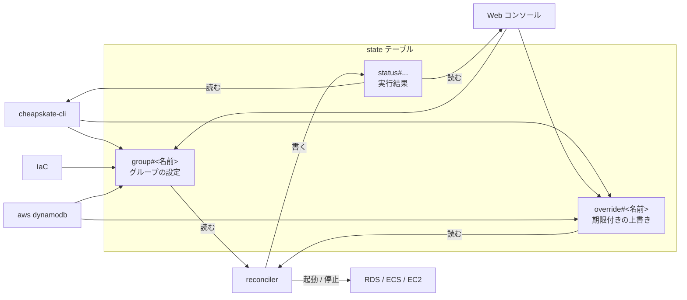

# 設定レコードの操作

cheapskate の設定は、DynamoDB の state テーブルのレコードがすべてである。このページは、そのレコードの追加・変更・確認・削除の方法と、レコードで設定できる項目を扱う。用語は [concepts.md](concepts.md)。



書き込み手段は `cheapskate-cli` / Web コンソール / IaC / `aws dynamodb` の 4 つで、どれも同じレコードを読み書きするだけである。優劣も排他もない。

リソースをグループに入れる操作はレコード側に存在しない。セレクタに一致するタグをリソースに付ける([resource_tag.md](resource_tag.md))。

## レコードで設定できる項目

### `group#<名前>` — グループの設定

| 属性 | 値 | 意味 |
| --- | --- | --- |
| `mode` | `pinned` \| `schedule` \| `disabled` | 望ましい状態の決め方。未設定は `disabled` 扱い |
| `desired` | `running` \| `stopped` | `mode=pinned` のときの望ましい状態。`pinned` では必須 |
| `start_cron` | 5 フィールド cron(例 `0 9 * * MON-FRI`) | `mode=schedule` の起動時刻 |
| `stop_cron` | 5 フィールド cron | `mode=schedule` の停止時刻 |
| `timezone` | IANA 名(例 `Asia/Tokyo`) | cron の評価に使う。未設定なら reconciler の `DEFAULT_TIMEZONE` |
| `tag_key` / `tag_value` | 任意の文字列 | セレクタのタグ。両方必須(値の空文字列は不可)。`aws:` 始まりのキーは不可 |
| `types` | 文字列セット: `rds-instance` `rds-cluster` `ecs-service` `ec2-instance` | セレクタの対象リソースタイプ。1 つ以上 |

- グループ名は `[A-Za-z0-9][A-Za-z0-9._-]{0,63}`(`#` と `/` は不可)
- `start_cron` / `stop_cron` は片方だけでもよい(起動だけ、停止だけのスケジュール)
- `mode` が `pinned` / `schedule` のグループはセレクタが必須

セレクタが欠けたまま `pinned` / `schedule` にした場合、設定エラーとして `status#group#<名前>` に記録される。

#### 夏時間のあるタイムゾーン

夏時間(DST)のある `timezone` では、切り替え帯(多くの地域で 01:00-03:00)を避けた時刻に cron を置くこと。cron はローカルの壁時計時刻で評価するため、春の繰り上げで消える時刻に置いた cron はその日発火しない。`start_cron` が飛べばその日は停止したまま、`stop_cron` が飛べば次の停止まで動き続ける。

秋の繰り下げで 2 回訪れる時刻は 2 回発火しうるが、どちらの発火でも望ましい状態は同じであるため影響しない。

### `override#<名前>` — 期限付きの上書き

| 属性 | 値 | 意味 |
| --- | --- | --- |
| `desired` | `running` \| `stopped` | 期限内はこの状態が優先される |
| `expires_at` | epoch 秒 | 失効時刻。テーブルの TTL 属性でもある |

グループのセレクタに一致する全リソースに適用される。期限切れの override は無視される。

### 優先順位

複数の設定が同時に成立する場合、上の行が優先される。

| 優先順位 | 条件 | 望ましい状態 |
| --- | --- | --- |
| 1 | `mode=disabled` | 決まらない。グループごと管理対象から外れる |
| 2 | 期限内の override がある | override の `desired` |
| 3 | `mode=pinned` | グループの `desired` |
| 4 | `mode=schedule` | `start_cron` / `stop_cron` の「直近の過去の発火時刻」が後の方に従う。同時刻なら stop |

`mode=disabled` は override より強いため、disabled なグループへの override 登録は拒否される。

望ましい状態と実状態が一致していれば何も書かず、通知もしない。遷移中(starting/stopping)のリソースは次のサイクルまで待つ。

## 追加

グループのレコードは `set-selector` で作られる(初回は `mode=disabled` となり、設定を書いてから有効化する順序になる)。

```console
export CHEAPSKATE_TABLE=<state-テーブル名>
cheapskate-cli set-selector --group dev --tag-key cheapskate:group --tag-value dev --types rds-cluster,ecs-service,ec2-instance
```

既存グループに対しては、セレクタだけを差し替える。`mode` / `desired` / cron / `timezone` は保持される。Web コンソールでは、一覧ページのフォームから同じ操作ができる。

生のレコードを直接書く場合:

```console
aws dynamodb put-item --table-name <state-テーブル名> --item '{
  "pk":        {"S": "group#dev"},
  "mode":      {"S": "pinned"},
  "desired":   {"S": "stopped"},
  "tag_key":   {"S": "cheapskate:group"},
  "tag_value": {"S": "dev"},
  "types":     {"SS": ["rds-cluster"]}
}'
```

Terraform では `aws_dynamodb_table_item` で `group#` を管理できる。reconciler は `group#` に書き込まないため、ドリフトしない。

## 変更

各コマンドが書き換える属性は次のとおりである。いずれも既存のグループにしか適用できない(タイプミスで新しいグループができることはない)。

| コマンド | 書き換える属性 | 保持される属性 |
| --- | --- | --- |
| `set-selector --group G --tag-key K --tag-value V --types T` | `tag_key` / `tag_value` / `types` | `mode`・`desired`・cron・`timezone` |
| `pin --group G stopped\|running` | `mode=pinned` + `desired` | cron・`timezone`・セレクタ |
| `unpin --group G` | cron があれば `mode=schedule`、なければ `disabled` | それ以外すべて |
| `schedule --group G -start C1 -stop C2 -timezone TZ` | `mode=schedule` + cron + `timezone` | セレクタ(`desired` は消える) |
| `disable --group G` | `mode=disabled` | それ以外すべて |
| `override --group G running -for 2h` | `override#` を作成(`desired` + `expires_at`) | `group#` は変更しない |
| `clear-override --group G` | `override#` を即時削除 | `group#` は変更しない |

```console
cheapskate-cli pin --group dev stopped                                              # 常時停止(RDS の 7 日自動起動も再停止される)
cheapskate-cli schedule --group dev -start "0 9 * * MON-FRI" -stop "0 20 * * MON-FRI" -timezone Asia/Tokyo
cheapskate-cli override --group dev running -for 2h                                 # 一時起動(TTL で自動失効)
cheapskate-cli clear-override --group dev
cheapskate-cli disable --group dev                                                  # 設定を残したまま管理を止める
```

不正な値(cron、タイムゾーン、`desired`、リソースタイプ、`-for` が 0 以下)は書き込み前に拒否される。Web コンソールでは、グループページに同じ操作のフォームがある。

override は TTL で消えるため、IaC 管理には向かない。

## 確認

```console
cheapskate-cli list                 # 全グループの group# + override# + status#group#
cheapskate-cli show --group dev     # 1 グループの同上 + セレクタに一致するリソース(status と現在の状態つき)
cheapskate-cli doctor               # テーブルの不整合と取り残されたレコードの診断(読み取りのみ)
```

全コマンドが stdout に JSON オブジェクトを 1 つだけ出力する。行のパースを要さず、そのまま `jq` に渡せる。失敗時は stderr に `{"error": "..."}` を出力して exit 1 となる。JSON ではない出力は usage(`cheapskate-cli -h`)のみである。

```console
$ cheapskate-cli pin --group dev stopped
{
  "command": "pin",
  "group": "dev",
  "mode": "pinned",
  "desired": "stopped"
}

$ cheapskate-cli list | jq -r '.groups[] | select(.mode == "schedule") | .name'
dev

$ cheapskate-cli show --group dev | jq -c '.resources[] | {ref, live: .live.state}'
{"ref":"dev-cluster/api","live":"running"}
```

| コマンド | 出力 |
| --- | --- |
| `list` | `{"command": "list", "groups": [...]}`。各グループは `name`・設定(`mode`・`desired`・cron・`timezone`・`selector`)・`override`(`expires_at` は RFC3339 UTC)・`status`。レコードが壊れている場合はそのグループの `error` に入り、他のグループは通常どおり出力される |
| `show` | `{"command": "show", "group": {...}, "resources": [...]}`。`group` は `list` と同じ形。`resources` は常に配列で、各要素に `type`・`ref`・`arn`・`status`・`live`(現在の状態)・`config`(リソースのタグ由来の設定)が入る。リソースの検出に失敗した場合は `discover_error` を含む(exit 0 のまま) |
| 更新系 | `command`・`group` と、そのコマンドが書き込んだ内容だけを返す。グループ全体を読み直すことはしない |
| `doctor` | `{"command": "doctor", "findings": [...], "pruned": 0, "counts": {...}}`。詳細は [troubleshooting.md](troubleshooting.md) |

`status#` の値は直近のアクションまたはエラーの時点のスナップショットであり、ライブ状態ではない。現在の状態は `show` の `live`、または Web コンソールのグループページで見る。例外は `transitioning_since` で、これは継続中の遷移の開始時刻であり、遷移が解消すると消える。

リソースごとの直近エラーは `status#` の `last_error` に、グループレベルの問題(不正な cron、検出の失敗、セレクタの重複)は `status#group#<名前>` に記録される。原因を直すと次のサイクルでクリアされる。

Web コンソールでは、一覧ページが全グループを 1 行ずつ、グループページが一致リソースの一覧を表示する。デプロイ手順は [setup.md](setup.md)。

## 削除

```console
cheapskate-cli remove --group dev          # override# → status#group# → group# の順に削除
cheapskate-cli clear-override --group dev  # override# だけを削除
```

AWS リソースには一切触れない。削除後、そのリソースは cheapskate の管理外になるだけであり、cheapskate が最後に置いた状態のまま残る。停止させたまま管理を外すつもりがないなら、`remove` の前に `override running` で起動させてサイクルを 1 回待つこと。ECS サービスの場合、停止中に管理を外すと desiredCount 0・Auto Scaling 0-0 のまま取り残され、cheapskate 側に戻す手段はない([troubleshooting.md](troubleshooting.md))。

リソースごとの `status#` は残る。セレクタに一致しなくなったリソースの `status#` も同様に残るが、無害である。

```console
cheapskate-cli doctor --prune   # 孤立レコードだけを削除する(設定と AWS リソースには触れない)
```

1 件だけ手で消す場合(`doctor` の各 finding の `pk` がそのまま使える):

```console
aws dynamodb delete-item --table-name <state-テーブル名> --key '{"pk":{"S":"status#ecs-service#dev-cluster/api"}}'
```

グループの管理を一時的に止めるだけなら、削除ではなく `disable` を使う(設定が残る)。ただし disabled なグループには override を登録できないため、あとから起動させるには `pin` か `schedule` へ戻す必要がある。

## 必要な IAM 権限

`cheapskate-cli` と Web コンソールの利用者に必要なのは次のみである。起動・停止の API 権限を要しない。

| 権限 | 用途 |
|---|---|
| state テーブルへの `dynamodb:Scan` / `GetItem` / `PutItem` / `DeleteItem` | レコードの読み書き |
| `tag:GetResources` | セレクタに一致するリソースの一覧 |
| RDS/ECS/EC2 の `Describe*` | `show` とグループページの現在の状態 |

`tag:GetResources` が無い場合、`doctor` は検出エラーを報告し、孤立の判定を見送る。
