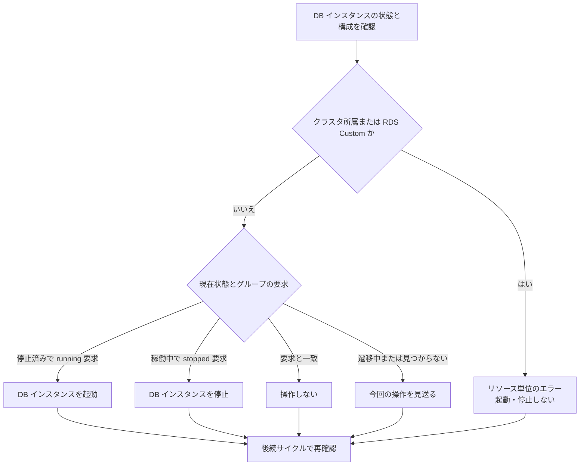
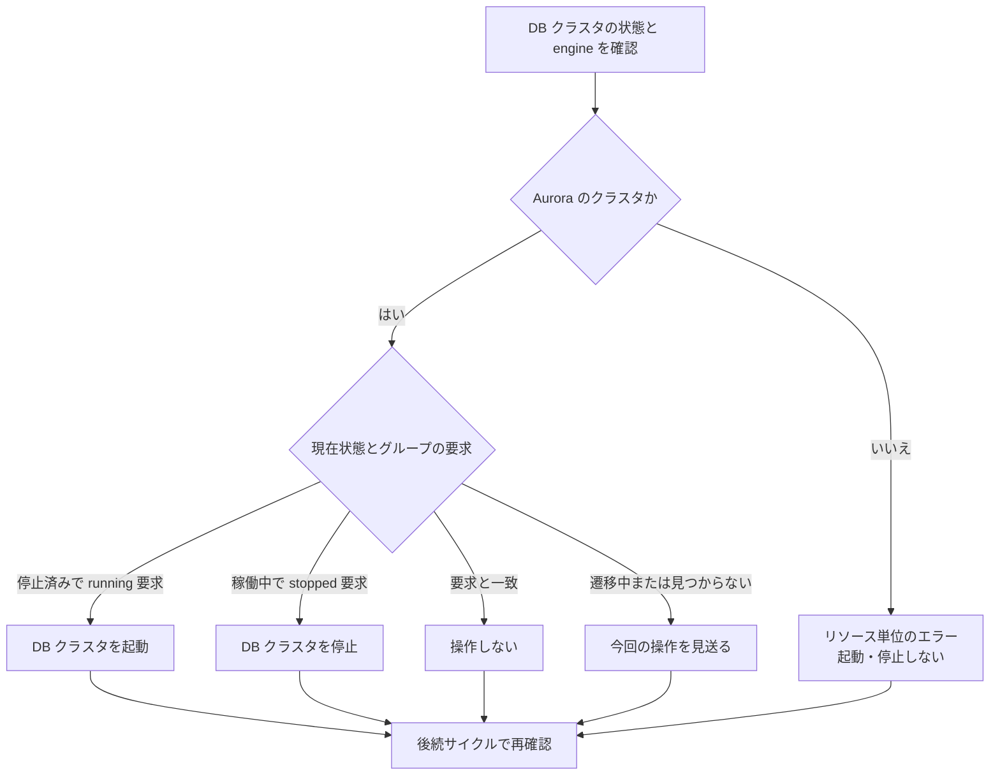
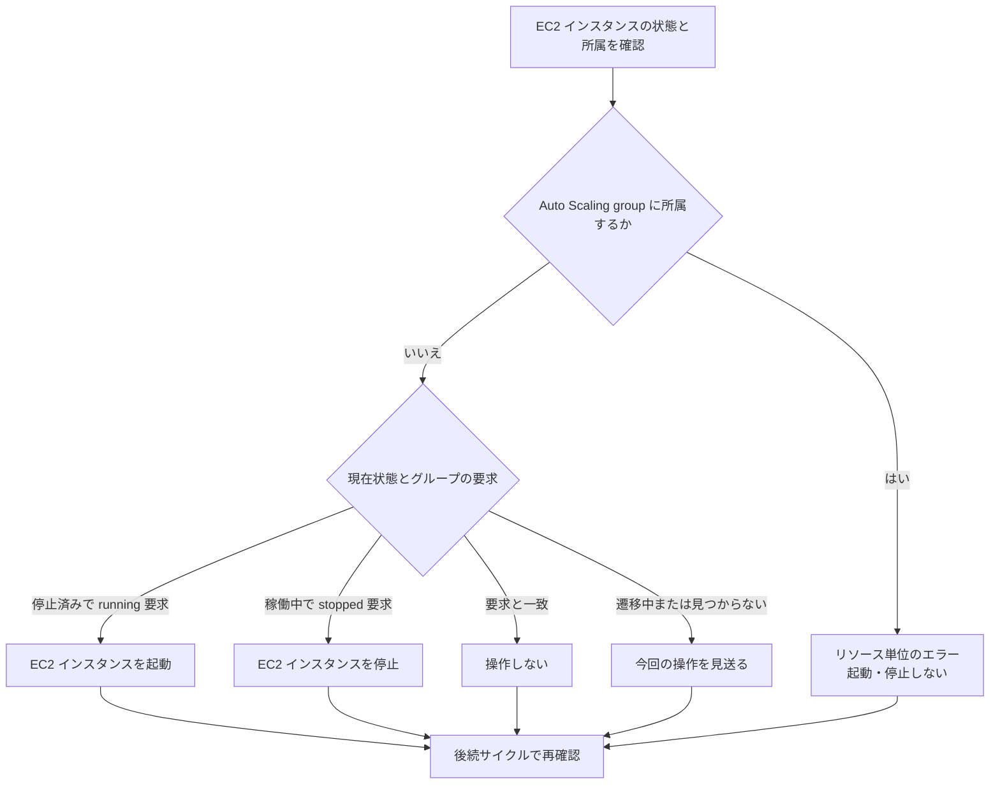
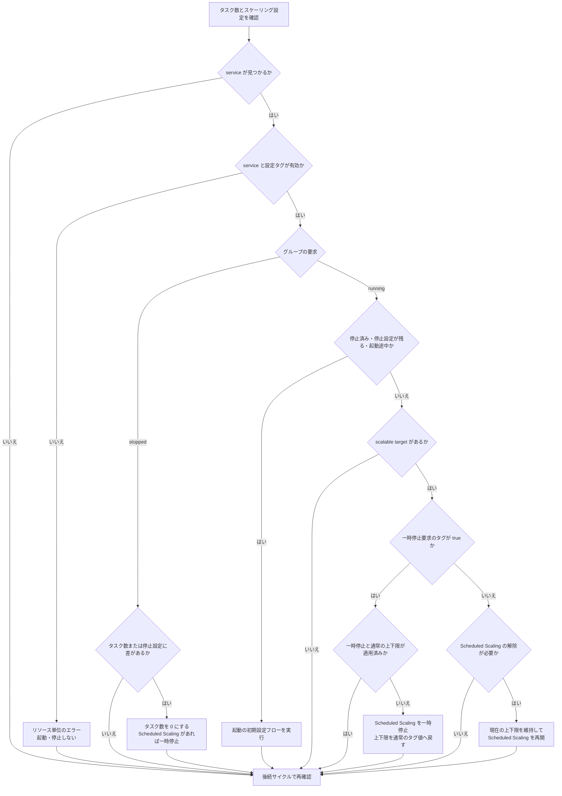
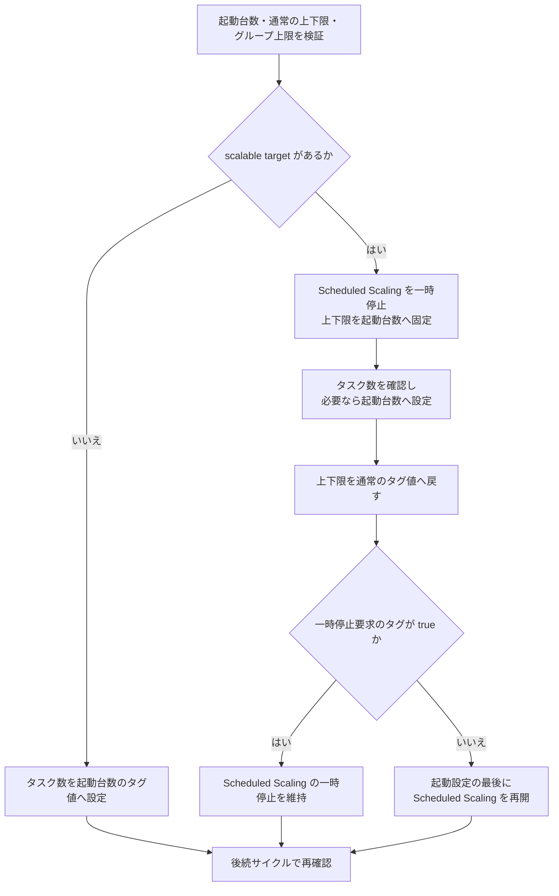

# リソースごとの処理フロー

本ドキュメントは、cheapskate による RDS DB インスタンス、Aurora DB クラスタ、EC2 インスタンス、および ECS service の起動・停止処理の概要を示す。

## 共通の処理

cheapskate は、通常は 5 分間隔で、グループ設定と所属タグから対象リソースへの要求を決める。グループ設定またはリソース一覧の読み込みに失敗した場合は、そのサイクルでリソースを操作しない。所属タグやグループ設定の不正は、該当リソースのエラーとして扱う。

グループの要求と操作の関係を、以下に示す。

| 要求 | 動作 |
| --- | --- |
| `running` | 対象リソースを稼働状態へ収束させる |
| `stopped` | 対象リソースを停止状態へ収束させる |
| `disabled` | 対象リソースの確認と起動・停止操作を行わない |

以下の図は、自動制御が有効なリソースに対する 1 サイクルの処理である。図の起動・停止は、対象の AWS リソースへの操作を指す。cheapskate 自体の実行停止では、適用済みの AWS 設定が残り、新しい要求の反映と再適用が行われなくなる。

起動・停止操作は、AWS が受け付けた時点でそのサイクルの処理を終える。cheapskate はリソースの遷移完了まで待機せず、後続サイクルで現在状態を再確認する。操作に失敗した場合も、後続サイクルで要求と現在状態を再比較する。

スケジュールと override による要求の決定は、[基本概念](concepts.md)を参照。

## RDS DB インスタンス

DB クラスタに所属しない、RDS Custom 以外の DB インスタンスを対象とする。インスタンス単位で起動・停止する処理を、次の図に示す。

RDS の状態が `available` の場合を稼働中、`stopped` の場合を停止済みとして扱う。その他の状態は遷移中として扱う。

## Aurora DB クラスタ

Aurora は DB クラスタを管理単位とする。所属する DB インスタンスを個別の停止対象として登録しないこと。クラスタ単位の処理を、次の図に示す。

RDS の状態が `available` の場合を稼働中、`stopped` の場合を停止済みとして扱う。その他の状態は遷移中として扱う。

## EC2 インスタンス

Auto Scaling group に所属しないインスタンスを対象とする。インスタンス単位の処理を、次の図に示す。

`running` と `stopped` をそれぞれ稼働中と停止済みとして扱う。`terminated` は見つからない状態として扱い、再起動しない。起動途中や停止途中のインスタンスへの操作は見送る。

## ECS service

ECS service の停止は、タスク数を 0 にする操作である。desired count、running count、および pending count がすべて 0 の場合だけ停止済みとする。その他は稼働状態として扱い、タスクの終了途中でも停止設定を適用する。

`REPLICA` の service を対象とし、設定タグが不正な service は起動・停止しない。起動の初期設定と稼働中の設定変更には、グループの `ecs_max_count` による上限の検証も必要である。

### 操作と設定の再適用

ECS は、タスク数の確認に加えて、Scheduled Scaling の一時停止とスケーリング上下限を確認する。処理の分岐を、次の図に示す。

scalable target がある場合の停止設定は、上下限 `0/0` と Scheduled Scaling の一時停止である。target がない場合はタスク数だけを変更する。一時停止要求が `false` でも、cheapskate による ECS service の停止要求が有効な間は Scheduled Scaling を一時停止する。

一時停止要求が `true` の稼働中は、上下限を通常のタグ値へ維持する。`false` の稼働中は、Scheduled Scaling による上下限の変更を許可する。稼働中の設定変更では、起動台数への再設定は行わない。ただし、上下限の適用によって範囲外の台数が調整される場合がある。

scalable target がない場合、一時停止設定の再適用は行わない。通常の上下限と異なる一時停止中の正の固定範囲は、起動途中として扱う。

### 起動の初期設定

停止済み、上下限 `0/0`、または起動途中の固定範囲が残る service への起動処理を、次の図に示す。

図の通常の上下限と一時停止要求は、同じ設定更新で適用する。起動設定の完了は、タスクがすべて起動し終わったことを意味しない。処理途中で失敗した場合は、適用済みの設定を残し、後続サイクルで現在のタグから復旧する。

一時停止要求のタグが `true` の間は、起動・停止を繰り返しても要求を解除しない。Scheduled Scaling の一時停止は、稼働中のすべての自動スケーリングを停止する指定ではない。

グループの要求が `running` の間に Scheduled Scaling がタスク数をすべて 0 にすると、後続サイクルで起動する。0 台を維持する時間帯は、cheapskate のスケジュールまたは `stopped` override で指定すること。

設定タグと上下限の管理範囲は、[リソースタグ](resource_tag.md#ecs-の復元設定)を参照。一時停止の解除と管理終了の手順は、[操作方法](operations.md#ecs-scheduled-scaling-の一時停止)を参照。
