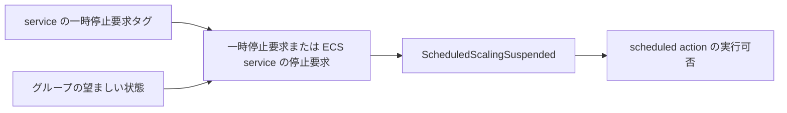

# ECS Scheduled Scaling 一時停止制御の設計

本ドキュメントは、ECS の Scheduled Scaling に対する一時停止要求を、明示的に解除するまで維持する設計である。要求の保存先、AWS への反映、起動・停止との優先順位、部分失敗からの復旧、および管理終了時の扱いを定める。本設計は ECS adapter に実装済みである。

## 用語

停止の対象を、以下のように区別する。

| 表現 | 意味 |
| --- | --- |
| cheapskate による ECS service の停止 | グループの望ましい状態が stopped であることに従い、ECS service のタスク数を 0 にして維持する制御 |
| Scheduled Scaling の一時停止 | AWS の ScheduledScalingSuspended=true によって、scheduled action によるスケーリングの開始を抑止する設定 |
| cheapskate 自体の実行停止 | reconciler の呼び出しを停止し、設定の反映やリソース状態の再適用が行われなくなる状態 |

本ドキュメントの起動処理、停止処理、および稼働状態は ECS service を対象とする。cheapskate 自体について述べる場合は、実行停止と明記する。

## 対応方針

ECS service 自身のタグで Scheduled Scaling の一時停止要求を保持する。cheapskate はそのタグを変更せず、タスクの起動、schedule の発火、および override の変更を理由に要求を解除しない。解除はタグへの false の設定かタグの削除によって行う。

Application Auto Scaling の scheduled action は併用を許可する。scheduled action の定義を保存、変更、または削除する処理は追加しない。停止前の AWS 設定を保存する処理も追加しない。

制御対象は ecs:service:DesiredCount の ScheduledScalingSuspended である。DynamicScalingInSuspended と DynamicScalingOutSuspended は変更しない。一時停止要求は Scheduled Scaling に対するものであり、ECS service の稼働中に target tracking と step scaling による台数変更を停止する要求ではない。

ScheduledScalingSuspended=true の間、AWS は scheduled action によるスケーリングを開始しない。AWS の各一時停止フラグの対象は、[SuspendedState](https://docs.aws.amazon.com/autoscaling/application/APIReference/API_SuspendedState.html)を参照。

## 設定と優先順位

### 一時停止要求のタグ

追加する ECS 設定タグを、以下に示す。

| 項目 | 定義 |
| --- | --- |
| タグキー | cheapskate/scheduled-scaling-paused |
| 値 | true または false |
| 未設定時 | false |
| true の意味 | ECS service の稼働中も Scheduled Scaling の一時停止を要求する |
| false の意味 | グループの望ましい状態が running の場合、ECS service の起動設定の完了後に Scheduled Scaling の実行を許可する |
| 空文字列・その他の値 | リソース単位の設定エラー |

値は小文字の true と false だけを受け付ける。タグを削除する操作は false の指定と同じ意味を持つ。タグに有効期限を設けず、cheapskate が true を false へ書き換える処理も追加しない。

タグは ECS service 単位の設定とする。同じグループに、一時停止を要求する service と実行を許可する service を所属させられる。DynamoDB のグループ属性と CLI の override の種類は追加しない。

scalable target がない場合もタグの書式は検証する。この場合には制御する Scheduled Scaling がないため、新しい target を作成しない。後から target が作成された場合は、次回 reconcile からタグの要求を適用する。

### AWS フラグとの対応

タグを一時停止要求の保存先とし、AWS の ScheduledScalingSuspended を実際の制御値とする。両者は別の設定である。cheapskate による ECS service の停止要求が有効な間は、タグが false でも AWS のフラグを true にする必要があるためである。

安定状態で適用する値を、以下に示す。

| グループの望ましい状態 | 一時停止要求のタグ | ScheduledScalingSuspended |
| --- | --- | --- |
| stopped | true | true |
| stopped | false または未設定 | true |
| running | true | true |
| running | false または未設定 | false |
| disabled | 任意 | 変更しない |

ECS service の起動処理の途中では、タグが false でも ScheduledScalingSuspended=true を維持する。起動設定が完了した最後の更新だけで false を設定できる。

安定状態の制御値は、次の条件で決定する。

```text
ScheduledScalingSuspended
  = 一時停止要求のタグが true
    OR グループの望ましい状態が stopped
```

要求から AWS 設定への関係を、次の図に示す。



AWS のフラグを直接変更しても、その変更を新しい一時停止要求として取り込まない。管理中はタグとグループの状態に従って再適用する。AWS 側で既に一時停止されている service を導入時にそのまま維持するには、タグに true を設定する必要がある。

## 上下限の管理範囲

上下限の管理範囲を、以下に示す。

| 状態 | 上下限の扱い |
| --- | --- |
| stopped | min/max=0/0 を維持する |
| 起動処理中 | 一時的に min/max=desired-count のタグ値に固定する |
| running かつ一時停止要求が true | scaling-min と scaling-max のタグ値を維持する |
| running かつ一時停止要求が false | 起動時にタグ値を適用した後は Scheduled Scaling による変更を許可する |

一時停止要求が false の通常稼働中は、AWS の上下限とタグ値が異なることだけを理由に Start を再適用してはいけない。scheduled action は上下限を変更するため、この差を無条件に修正すると併用できない。AWS による上下限変更と範囲外の capacity の調整は、[How scheduled scaling works](https://docs.aws.amazon.com/autoscaling/application/userguide/scheduled-scaling-policy-overview.html)を参照。

この管理範囲は scheduled action の有無によらず適用する。Scheduled Scaling を使わず、タグの上下限を継続的に維持する service には一時停止要求を true とする設定を推奨する。false の通常稼働中にタグの上下限を変更しても、次の起動の初期設定までその値を適用しない。

一時停止要求が true の稼働中はタグの上下限を通常値として扱う。この範囲を維持することで、起動途中の一時的な固定範囲と通常稼働を区別し、状態を保存せずに復旧できる。

false から true への変更では、Scheduled Scaling の実行を止めることに加えて、上下限をタグ値へ戻す。この再適用で現在の desired count が範囲外となる場合、AWS が範囲内へ調整する。タスク数を現在値のまま維持したい場合は、先にタグの上下限をその値を含む範囲へ変更する必要がある。一時停止は現在のタスク数と上下限を固定保存する操作ではない。

true から false への変更だけを行う場合は、現在の上下限を維持して Scheduled Scaling を再開する。既に動いているタスクの desired count を起動台数のタグ値へ再設定しない。

## AWS 操作

### ECS service の停止処理

タグ一式を検証し、既存の scalable target を取得する。target がある場合の停止リクエストは、次のとおりである。

```text
RegisterScalableTarget(
  MinCapacity=0,
  MaxCapacity=0,
  SuspendedState.ScheduledScalingSuspended=true
)
```

停止の上下限と Scheduled Scaling の一時停止を同じリクエストで送る。UpdateService と rollback は追加しない。target がない場合は現行どおり UpdateService(desiredCount=0) を使用する。

タグの要求が false であっても、この停止リクエストで false を送ってはいけない。停止時にもタグ自体は変更しない。

### ECS service の起動処理と設定の再適用

Start は、ECS service と scalable target の現在状態を再取得して、起動の初期設定が必要か、稼働中の設定の再適用だけが必要かを判定する。起動台数と通常の上下限のタグ検証、ecs_max_count による既存の起動上限検証は維持する。

起動の初期設定が必要な場合は、次の順序で処理する。

1. min/max を desired-count のタグ値へ固定し、ScheduledScalingSuspended=true を設定する。
2. desired count を再取得し、起動台数と異なる場合だけ UpdateService で設定する。
3. min/max を scaling-min と scaling-max のタグ値へ戻し、ScheduledScalingSuspended に一時停止要求のタグ値を設定する。

最後の更新は、通常の上下限が起動台数と同じ場合にも必要なフラグの値を適用する。タグが true の場合には、一時的にも false を送ってはいけない。

稼働中の設定の再適用では、次の規則を使用する。

| 一時停止要求 | 再適用 |
| --- | --- |
| true | タグの通常の上下限と ScheduledScalingSuspended=true を適用する |
| false | 上下限を指定せず、ScheduledScalingSuspended=false だけを適用する |

この再適用では desired-count のタグ値への UpdateService を行わない。起動台数の初期設定と、一時停止要求の変更による再適用を区別するためである。ただし、RegisterScalableTarget はフラグだけの更新であっても、capacity が現在の上下限の外にある場合に調整しうる。API の動作は、[RegisterScalableTarget](https://docs.aws.amazon.com/autoscaling/application/APIReference/API_RegisterScalableTarget.html)を参照。

### 更新するフラグの範囲

SuspendedState には ScheduledScalingSuspended だけを設定する。AWS SDK の DynamicScalingInSuspended と DynamicScalingOutSuspended は nil のまま送信し、明示的な false を設定しない。他の一時停止設定の解除を防ぐためである。

scalable target の識別には現行の ServiceNamespace=ecs、ResourceId=service/{cluster}/{service}、ScalableDimension=ecs:service:DesiredCount を使用する。scheduled action の存在検査は不要であり、DescribeScheduledActions の API と IAM 権限は追加しない。

## 状態判定と復旧

### 観測する状態

ECS の State は現行どおり、desired count、running count、および pending count がすべて 0 の場合だけ stopped とする。設定の未適用は、実際のタスク状態とは分けて観測する。

scalable target の上下限が 0/0 の場合は、起動の初期設定が必要な状態として扱う。ScheduledScalingSuspended=true、上下限が同じ正の値、かつ通常の上下限タグと異なる場合は、起動途中に残った固定範囲として扱う。固定値が起動台数のタグ値と同じであることは条件にしない。再試行前に起動台数のタグが変更される場合も、現在の設定で復旧するためである。

一時停止要求が true の通常稼働でタグと異なる固定範囲を維持することは、対応範囲に含めない。この管理契約により、通常稼働の設定と起動途中の固定範囲の区別が成立する。

Describe の再適用判定を、以下にまとめる。各判定は、望ましい状態に応じて既存の reconcile が使用する。

| 判定 | 条件 |
| --- | --- |
| NeedsStop | target の上下限が 0/0 でない、または ScheduledScalingSuspended が false |
| NeedsStart | target の上下限が 0/0、または起動途中の固定範囲が残っている |
| NeedsStart | ScheduledScalingSuspended が一時停止要求のタグ値と異なる |
| NeedsStart | 一時停止要求が true で、上下限が通常のタグ値と異なる |
| 再適用なし | 一時停止要求が false、ScheduledScalingSuspended=false、かつ上下限が 0/0 でない通常稼働 |

取得した SuspendedState または ScheduledScalingSuspended が nil の場合は false と解釈する。起動済みの desired count と起動台数タグとの差だけでは Start を再適用しない。

Start は stopped の観測、上下限 0/0、または起動途中の固定範囲から初期設定を再開する。それ以外では設定の再適用だけを行う。タスク状態が既に running であっても、上下限 0/0 が残る停止途中の状態は初期設定の対象である。

### 部分失敗

API 失敗時には、その時点で AWS に適用された設定を残す。次回 reconcile で現在のタグと AWS 設定から処理を再開する。対象の復旧条件を、以下に示す。

| 失敗箇所 | 次回の処理 |
| --- | --- |
| 停止リクエストが未適用 | 上下限またはフラグの差から停止を再適用する |
| 起動台数への固定後 | 固定範囲を検出し、起動の初期設定を再開する |
| desired count の取得・設定 | Scheduled Scaling を停止したまま初期設定を再開する |
| 通常の上下限と最終フラグへの更新 | 残った固定範囲または設定の差から再適用する |
| 一時停止要求が false で、最後の更新の応答だけが失われる | フラグが false の通常稼働として扱い、Scheduled Scaling が変更した上下限を戻さない |
| 一時停止要求が true で、最後の更新の応答だけが失われる | タグの上下限と true が一致していれば再適用しない |
| 起動台数と通常の上下限がすべて同じで、一時停止要求が true | 最初の固定操作で収束していれば、後続の失敗後も追加操作は不要である |

一時停止要求が true であることだけを、起動途中の判定に使用してはいけない。起動完了後も true が正当な状態であるためである。

## 運用上の境界

### タスク数 0 の扱い

running は現行どおり、タスクがすべて 0 である場合に起動を要求する。グループの望ましい状態が running の間に scheduled action や動的スケーリングがタスク数を 0 にしても、次回 reconcile で起動台数と通常の上下限へ戻す。

タスク数を 0 のまま維持する時間帯は、cheapskate の schedule または stopped override で指定する。Scheduled Scaling の上下限 0/0 による停止と、cheapskate の running 要求を競合させる構成は使用しない。Scheduled Scaling と協調してタスク数 0 を通常稼働として許可する機能は、この設計に含めない。

scheduled action の発火時刻と cheapskate による ECS service の停止判定が重なる場合も、一時停止設定の反映とタスク数の減少には遅延がある。この設計による停止の優先は状態の収束に対するものであり、時刻の一致による単一の AWS 操作の順序保証ではない。

### 再開時の schedule と台数上限

AWS は一時停止中に実行時刻を過ぎた scheduled action を、再開時に実行しない。起動時はタグの上下限を適用し、その後に実行時刻を迎える action から Scheduled Scaling を使用する。現在時刻に適した上下限を過去の action から計算する処理は追加しない。再開時の動作は、[Suspend and resume scaling](https://docs.aws.amazon.com/autoscaling/application/userguide/application-auto-scaling-suspend-resume-scaling.html)を参照。

ecs_max_count は既存の Start の起動台数と通常の scaling-max に適用する。scheduled action 自体の MinCapacity と MaxCapacity はこの検証を通らないため、Scheduled Scaling による台数に対する絶対上限を保証しない。導入時には scheduled action の上下限も確認する必要がある。

### 設定反映と同時実行

一時停止要求のタグは、次の正常な reconcile で反映する。通常の自動呼び出しは 5 分間隔であり、タグを書き込んだ瞬間に AWS の動作を停止する保証はない。

一時停止要求が true の snapshot を処理する invocation は、ScheduledScalingSuspended=false を送信してはいけない。タグとグループの設定が維持されている間は、起動や時刻の到来によって一時停止を解除しない。

タグ変更前またはグループ変更前の snapshot を持つ invocation は、古い要求を適用しうる。最新の設定を反映する保証は、古い invocation の終了後に成功する reconcile の収束である。タグ取得と AWS 変更を単一トランザクションにする処理、リース、および即時停止バリアは追加しない。

ScheduledScalingSuspended=true は新しい scheduled action の開始を抑止する。停止前に開始された AWS 操作の取り消しと、タスクの即時停止は保証しない。上下限とフラグの再適用、およびタスク数の観測で停止へ収束させる。

### cheapskate 自体の実行停止

cheapskate 自体の実行停止は、ECS service の停止要求として扱わない。reconciler の呼び出しを停止しても、その操作だけで ECS service のタスク数や ScheduledScalingSuspended は変更されない。

既に AWS へ適用された ScheduledScalingSuspended=true は、cheapskate 自体の実行停止後も AWS 側で維持される。false の場合は scheduled action の実行が許可されたままとなる。実行停止中にタグやグループの望ましい状態を変更しても、新しい設定は reconciler の呼び出し再開後に正常な reconcile が行われるまで反映されない。外部操作で AWS の設定が変更された場合も、実行停止中には再適用できない。

### 管理終了

disabled、グループ削除、および所属タグ削除では AWS のフラグと上下限を自動復元しない。管理終了後も、その時点の設定が残る。

Scheduled Scaling を有効にして管理を終了する場合は、一時停止要求を false にし、running override で起動設定の完了と AWS フラグが false であることを確認してから管理を終了する。現在の起動台数と上下限のタグ値を適用する手順であり、管理開始前の設定への復元ではない。

一時停止を維持して管理を終了する場合は、要求を true にした状態で収束を確認する。グループを disabled にしただけでは、自動復元も一時停止要求の新たな適用も行われない。

## 表示と権限

一時停止要求のタグを ConfigTags に追加し、CLI と Web コンソールに設定値を表示する。JSON の設定名は scheduled_scaling_paused とする。live の Detail には実際の ScheduledScalingSuspended と上下限も含め、要求と反映結果を区別できるようにする。

状態判定の不一致による設定再適用は既存の Start または Stop として記録する。Start の記録は、タスクの初期設定と running 状態への設定再適用を含む。エラー、後続リソースの処理継続、および API 成功後だけのアクション通知は既存の動作を維持する。

既存の DescribeScalableTargets、RegisterScalableTarget、DescribeServices、および UpdateService を使用する。Application Auto Scaling の API interface と IAM アクションは追加しない。タグの設定には ECS service のタグ更新権限が必要であり、cheapskate の reconciler はタグを書き込まない。

## 導入手順

導入前には、AWS 側の一時停止設定とタグの要求を対応させる必要がある。手順を、以下に示す。

1. 管理対象の scalable target の一時停止フラグと scheduled action の上下限を確認する。
2. ECS service の稼働中も Scheduled Scaling を止めておく service には、cheapskate/scheduled-scaling-paused=true を設定する。再開を許可する service には false を設定する。
3. 起動台数、通常の上下限、および ecs_max_count を確認する。Scheduled Scaling で変更した上下限をタグ値と区別する。
4. 一時停止制御を実装したバージョンを配置する。
5. フラグ ON の起動・停止、フラグ OFF の再開、および通常稼働中の scheduled action による上下限変更を確認する。

未設定の既定値は false であるため、AWS 側の既存の一時停止を維持する service のタグ設定は配置前に完了する必要がある。現行バージョンで停止済みの target が 0/0 である場合は、起動時に初期設定を行うか、停止を維持する次回 reconcile で ScheduledScalingSuspended=true を追加する。

既存の ScheduledScalingSuspended=true と正の固定範囲が起動途中の判定条件に一致する場合、停止前の状態保存なしにはその設定の作成理由を区別できない。導入時には、その範囲を通常の上下限タグとして宣言して一致させるか、起動の初期設定で更新する構成として起動台数を確認する必要がある。

## 実装対象

実装と検証に関係するファイルを、以下にまとめる。

| 対象 | 変更内容 |
| --- | --- |
| internal/core/model/resource_ecs.go | 一時停止要求のタグキーと ConfigTags の宣言 |
| internal/core/model/resource_test.go | 設定の列挙と表示名の検証 |
| internal/aws/compute/ecs.go | タグ解析、フラグ更新、初期設定と再適用の分岐、状態判定 |
| internal/aws/compute/ecs_test.go、internal/aws/compute/ecs_scheduled_scaling_test.go | フラグ維持、部分失敗、scheduled action との協調の検証 |
| internal/app/reconcile/reconcile_test.go | 起動済み・停止済みの設定再適用とエラー分離の確認 |
| internal/ui/cli/cli_test.go、internal/ui/webconsole/webconsole_test.go | 要求と反映結果の表示確認 |
| docs/ja/usage/resource_tag.md、docs/en/usage/resource_tag.md | 新しいタグ、上下限の管理範囲、タスク数 0 の制約 |
| docs/ja/usage/operations.md、docs/en/usage/operations.md | フラグ解除と管理終了の手順 |
| docs/ja/development/reconcile.md、docs/en/development/reconcile.md | ECS の状態判定と部分失敗の復旧条件 |
| spec__slim.md | 対応するタグ、停止・起動操作、および管理の境界 |

Start は現在状態を確認するため、既存の desiredCount の取得処理を service の観測と共通化する。初期設定中の固定操作後には desired count を再取得する必要がある。Stop の scalable target 取得と変更 API の数は維持する。

application port、Observation のフィールド、および DynamoDB スキーマの変更は不要である。API interface を変更しないため、AWS mock の再生成は不要である。既存の API 呼び出し順序と回数に依存する ECS テストは分岐に合わせて更新する。

## 検証条件

実装時には生成 mock で AWS の状態変更と失敗を再現する。要求の維持と収束について、以下の条件を確認する。

| 条件 | 確認内容 |
| --- | --- |
| タグが true の複数回の起動・停止 | false を一度も送らず、タグを書き換えない |
| タグが true の稼働状態で時刻が進む | 一時停止要求を維持し、収束後に変更操作を繰り返さない |
| タグが false の停止 | 0/0 と true を同じリクエストに含める |
| タグが false の起動 | 起動設定の完了まで true を維持し、最後の更新で false を適用する |
| 稼働中の true から false への変更 | 現在の上下限を維持し、起動台数への UpdateService を呼ばない |
| 稼働中の false から true への変更 | true とタグの通常範囲を適用し、起動台数への UpdateService を呼ばない |
| 他の二つの一時停止フラグが true | そのフラグの false を送らない |
| 通常稼働中に scheduled action が上下限を変更 | 一時停止要求が false ならタグ値への再適用と通知を行わない |
| 起動途中の固定範囲が残る | 一時停止要求が true と false のどちらでも起動を完了する |
| 起動台数と通常の上下限がすべて同じ | true の維持と false の再開の両方で収束する |
| API 未適用の失敗・応答だけの喪失 | 次回の状態判定が必要な処理だけを再開する |
| 起動途中に起動台数のタグが変更 | 残った固定範囲を検出し、現在のタグ値で復旧する |
| タグが未設定・不正、scalable target がない | 既定値と設定エラーと API 分岐を確認する |
| タスクがすべて 0、望ましい状態が running | 現行の起動要求を維持する |
| disabled と管理終了 | AWS 設定を自動解除しない |
| 古い snapshot と新しい snapshot の競合 | 古い invocation 終了後に最新の要求へ収束する |

実装の検証では make unit、make integration、および make lint が通過している。AWS 実環境での検証は未実施である。AWS 上の検証では、フラグ ON の間に実行時刻を迎える scheduled action が開始されないこと、OFF の起動後に将来の action が実行されること、タグ変更が reconcile で反映されることを確認する。
